# Vecton Metadata 架构说明

本文基于当前代码编写，目标是帮助第一次接触 `metadata` 模块的开发者在 15 到 30 分钟内建立可维护的整体认知。文档中的“当前实现”指当前仓库代码事实；“设计目标”或“历史痕迹”只在代码尚未完全落地时显式标出。

## 1. Metadata 在 Vecton 中的定位

`metadata` 是 Vecton 的元数据权威服务。它维护命名空间、inode、dentry、attrs、mount、shard ownership、route epoch、block metadata、delete intent、worker descriptor 等控制面状态，并通过 `proto/metadata/filesystem.proto` 暴露 path-first 的文件系统 RPC。

它不直接执行数据面 IO。客户端从 metadata 获取文件、写会话、block 或 worker 路由信息后，数据读写应走 client 到 worker 的直接路径；worker 再通过 heartbeat、block report、task ack 等接口把运行时状态反馈给 metadata。这个边界对应根目录 `AGENTS.md` 和 `metadata/AGENTS.md` 中的约束：metadata 负责 authority、commit boundary 和一致性闭环，worker 负责 block/chunk/stream 的本地 IO 和执行。

metadata 的权威范围：

| 权威对象 | 当前承载位置 | 说明 |
| --- | --- | --- |
| inode / dentry / attrs | `metadata/src/raft/storage.rs`、`types/src/fs.rs` | 文件系统命名空间的持久事实。path 只是解析入口，不是持久 authority。 |
| mount table | `metadata/src/mount/mod.rs`、`metadata/src/bootstrap.rs` | longest-prefix resolve、root mount invariant、mount epoch 和 owner group。 |
| namespace ownership / shard routing | `metadata/src/raft/command.rs`、`metadata/src/raft/storage.rs` | `CreateMount` 持久化 owner group；`AddShardGroup` 维护 shard routing，但当前不推进 filesystem-facing `route_epoch`。 |
| block metadata / layout / refcount | `metadata/src/raft/storage.rs`、`metadata/src/raft/state_machine.rs` | block 是管理、reporting、repair 单元；chunk 是 worker 本地 IO/checksum/repair 单元。 |
| worker descriptor | `metadata/src/worker/service.rs`、`metadata/src/worker/manager.rs` | worker 的低频身份和 descriptor 通过 Raft 持久化；heartbeat 和 block presence 是内存软状态。 |
| request consistency | `common/src/header/types.rs`、`common/src/error/mod.rs`、`metadata/src/service/fs_core/freshness.rs` | `mount_epoch`、`route_epoch`、`state_id`、`worker_epoch`、fencing token 构成刷新闭环。 |

metadata 与其他模块的基本关系：

- `common/` 提供 canonical error、request/response header、config、observability 基础能力。
- `types/` 提供 inode、block、lease、worker、mount、routing 等强类型模型。
- `proto/` 定义 wire contract；metadata 不拥有 proto 生成代码。
- `client/` 消费 `ResponseHeader.error` 并执行 refresh/replay action machine。
- `worker/` 执行数据面 IO；metadata 只通过 worker metadata RPC 接收状态、下发 repair/delete/move/evict 任务。
- `ufs/` 提供外部后端抽象；当前 metadata 启动时构造 UFS registry/proxy，但 FileSystemService 尚未把 UFS metadata proxy 接入主链路。

## 2. 总体架构图

当前 Rust 服务实现中，外部文件系统入口是 `MetadataFileSystemServiceImpl`。`proto/metadata/filesystem.proto` 中仍有“external clients should not call InodeService directly”的注释，但当前 `metadata/src/service` 下没有独立的 Rust `InodeService` 服务实现；更底层的共享业务入口是 `FsCore`。

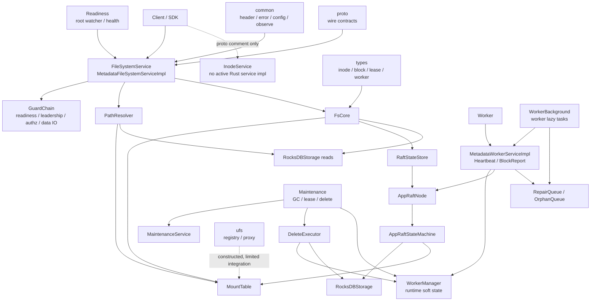

## 3. 目录结构与模块职责

`metadata/src` 的模块边界不是简单按文件名分层。核心原则是：service 层做 RPC 适配、guard、authz、proto/domain 转换；`FsCore` 承载共享业务规则；Raft state machine 承载 authoritative mutation；RocksDB 承载持久状态；worker/background 维护运行时软状态和异步任务。

| 模块/文件 | 核心职责 | 关键类型/函数 | 说明 |
| --- | --- | --- | --- |
| `metadata/src/bin/main.rs` | 真实进程入口 | `main()` | 只负责串联 runtime composition 函数并把最终服务交给 `serve()`，保持薄入口。 |
| `metadata/src/runtime.rs` | metadata runtime composition root | `load_config()`、`init_observability()`、`build_authority()`、`build_worker_manager()`、`build_worker_service()`、`build_maintenance()`、`build_worker_background()`、`build_readiness()`、`build_filesystem_service()`、`compose_services()`、`serve()` | 当前启动边界的主入口；把 authority、worker manager、worker service、worker background、maintenance、readiness、RPC service registration 分开表达。 |
| `metadata/src/bootstrap.rs` | root mount 启动引导 | `ensure_root_mount()` | 保证 root mount 的 invariant；非 leader 场景遇到 leader changed 会记录并返回，等待后续 readiness。 |
| `metadata/src/config.rs` | metadata 配置模型 | `MetadataConfig`、`AuthzConfig`、`WorkerConfig` | 仍有部分 TODO，例如 raft/shard 配置扩展和 DB path 配置化。 |
| `metadata/src/error.rs` | metadata domain error 到 canonical error 的显式映射 | `MetadataError`、`to_canonical_rpc()`、`to_canonical_fs()` | 当前生产路径使用显式 mapper，不依赖隐式 `From<MetadataError>`。 |
| `metadata/src/service/path_service.rs` | FileSystemService RPC 适配层 | `MetadataFileSystemServiceImpl` | 外部 path-first 入口；负责 header、guard、path resolve、authz、proto/domain 转换，核心业务下沉到 `FsCore`。文件仍较大，是后续可拆分点。 |
| `metadata/src/service/fs_core/` | 共享 filesystem domain core | `FsCore`、`FreshnessValidator`、`WriteSessionCoordinator` | 承载 mount/route freshness、write session、mutation/read orchestration；不直接处理 tonic request。 |
| `metadata/src/service/domain.rs` | service 与 core 之间的 domain DTO | `RequestContext`、`Freshness`、`CoreSuccess`、`CoreFailure` | 避免把 proto 类型扩散到 core 业务逻辑。 |
| `metadata/src/service/guard.rs` | 请求保护链路 | `GuardPolicy`、`GuardChain`、`ReadinessGuard`、`LeadershipGuard`、`DataIoPolicyGuard` | 只做服务门禁：readiness、leadership、authz、data IO policy；不承载 mount/route/session/fencing domain freshness。 |
| `metadata/src/service/authz.rs` | 授权抽象和 ACL/Ranger provider | `AuthzProvider`、`AclInodeAuthz`、`StubRangerAuthz` | ACL 是 inode xattr MVP；Ranger 当前是 allow-all stub，会记录 `authz_stub = true`。 |
| `metadata/src/service/core_util.rs` | header/error/proto 转换辅助 | `header_from_core_failure()`、`ok_header_from_core_success()`、`need_refresh_header()` | `MOVED` refresh reason 在 FileSystemService 中被显式 de-scope。 |
| `metadata/src/path_resolver.rs` | path 到 inode 的适配解析 | `PathResolver`、`ResolvedPath`、`ResolvedInode` | 基于 `MountTable` longest-prefix 和 dentry walk；path 不持久化为 authority。 |
| `metadata/src/mount/mod.rs` | 内存 mount table 和 mount resolve | `MountTable`、`MountEntry`、`DataIoPolicy` | 启动时从 RocksDB 加载；Raft apply 后同步 upsert/remove；子 mount 通过更长 prefix 覆盖父 mount。 |
| `metadata/src/raft/command.rs` | authoritative write vocabulary | `Command`、`FsCommand`、`DedupKey` | 所有持久 mutation 应通过命令表达；dedup fingerprint 排除 call_id。 |
| `metadata/src/raft/state_machine.rs` | Raft apply 后的权威状态变更 | `AppRaftStateMachine::apply()` | 负责 inode/dentry/layout/refcount/mount/shard/worker descriptor/delete intent 的持久 mutation。 |
| `metadata/src/raft/node.rs` | OpenRaft node 封装 | `AppRaftNode` | 负责 propose、read、membership、snapshot policy 和 network factory。 |
| `metadata/src/raft/state_machine_store.rs` | OpenRaft state machine storage | `StateMachineStorage` | 负责 applied state、snapshot build/install、调用 `AppRaftStateMachine`。 |
| `metadata/src/raft/storage.rs` | RocksDB schema 与读写 API | `RocksDBStorage` | 维护 replicated state CF、raft CF、FS CF；同时还有部分直接状态写入路径，需要持续收敛。 |
| `metadata/src/state/raft_store.rs` | service/core 面向的 StateStore 实现 | `RaftStateStore` | read 当前通过 `AppRaftNode::read(false, ...)` 做 leader-read 检查；write 走 propose。 |
| `metadata/src/worker/service.rs` | worker metadata RPC | `MetadataWorkerServiceImpl` | 处理 register、heartbeat、block_report、task ack；`report_presence` 当前 deprecated no-op。 |
| `metadata/src/worker/manager.rs` | worker runtime soft state | `WorkerManager` | 持有 heartbeat、block location、full report lease、metadata epoch 等内存态。 |
| `metadata/src/worker/repair/` | repair planning 和队列 | `RepairPlanner`、`RepairQueue`、`OrphanQueue` | planner 是纯决策；任务通过 heartbeat 下发和 ack 推进。 |
| `metadata/src/maintenance/` | 后台维护任务 | `MaintenanceService`、`LeaseCleanup`、`Gc`、`OverReplicationCleanup` | leader-only 后台任务、gate、backoff、inflight 控制；模块仍在整理中。 |
| `metadata/src/worker/delete_executor.rs` | block delete intent 执行器 | `DeleteExecutor` | 执行持久 delete intent，带 destructive gate、block report convergence、lease/inflight 检查。 |
| `metadata/src/readiness.rs` | root readiness gate | `RootReadinessGate` | gRPC health 与 request guard 共享 readiness 状态。 |
| `metadata/src/ufs_proxy.rs` | UFS metadata proxy | `UfsMetadataProxy` | 当前 runtime 构造了该对象，但主 FileSystemService 尚未把它作为 namespace mutation/read 的执行路径。 |
| `metadata/src/*tests*` | 单元/集成测试 | `runtime::tests`、`fs_core::tests`、`worker::*tests` | 覆盖启动阶段、guard、authz、worker report、delete executor、repair 等局部合同。 |

## 4. 启动链路

当前启动链路以 `metadata/src/bin/main.rs` 为真实入口，组合逻辑集中在 `metadata/src/runtime.rs`。`main()` 不再包含 `#[path = "..."]` 的生产模块绕行，也不直接构造底层对象；它只按顺序调用短函数，把最终 `RpcServices` 和 `RuntimeHandles` 交给 `serve()`。

当前代码保留的 runtime 对象都对应长期职责：`MetadataAuthority` 表示 authority bundle，`WorkerService` 表示 worker RPC 入口及其 worker-owned repair state，`WorkerBackground` 表示 worker heavy background task handle 与 repair state，`Maintenance` 表示 metadata maintenance resources 及 task handles，`Readiness` 表示 root readiness watcher 与 health state，`RpcServices` 表示最终注册的 RPC services，`RuntimeHandles` 表示 `serve()` 需要持有到 server 生命周期结束的后台 task handles。

`RuntimeHandles` 当前持有 `WorkerBackgroundHandle`、`MaintenanceHandle`、`DeleteExecutorHandle`、`ReadinessHandle`，语义是保留这些 `JoinHandle` 不再在 start 方法内部丢弃。当前代码还没有 cancellation token 或逐 task join 流程，因此这里不声明完整 graceful shutdown；server 退出后由进程 / Tokio runtime 结束这些后台循环。

`runtime::tests::runtime_composition_separates_worker_maintenance_and_readiness`、`runtime::tests::runtime_handles_hold_started_background_tasks` 和 `runtime::tests::worker_service_supplies_background_inputs_without_optional_worker_mode` 覆盖当前组合关系与 lifecycle handle 持有关系。

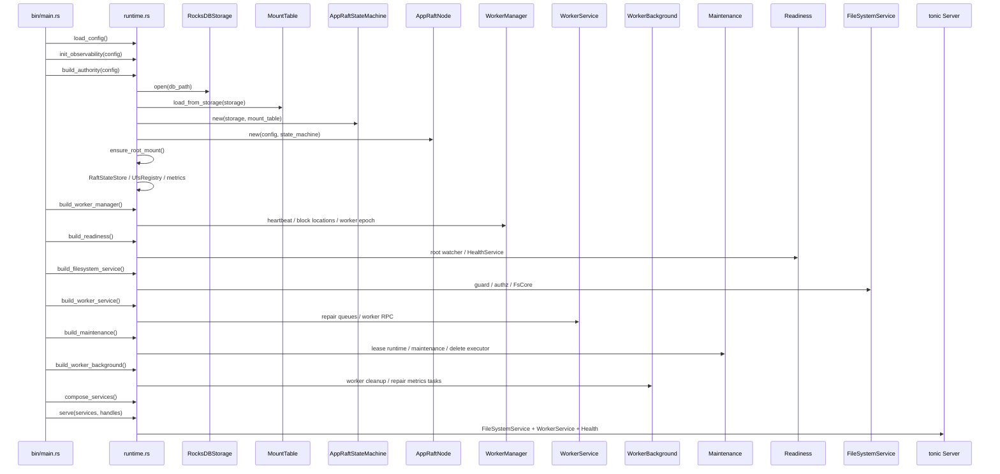

启动阶段职责：

| 阶段 | 输入 | 输出 | 副作用 | 边界意义 |
| --- | --- | --- | --- | --- |
| `load_config()` | 环境变量 `VECTON_CONFIG`，默认 `conf/core-site.yaml` | `Arc<MetadataConfig>` | 读取配置文件 | 只表达配置加载，不承担 observability 或 authority 初始化。 |
| `init_observability()` | `MetadataConfig` | `Observability` | 初始化 tracing / metrics provider，并记录已加载配置的非敏感摘要 | 只负责进程级 observability guard 的生命周期。 |
| `build_authority()` | `MetadataConfig` | `MetadataAuthority` | 打开 RocksDB，加载 mount，构造 Raft state machine / Raft node，确保 root mount，构造 `RaftStateStore` 和 UFS registry/proxy | 保持 authority bootstrap 顺序：`RocksDBStorage -> MountTable -> AppRaftStateMachine -> AppRaftNode -> ensure_root_mount -> RaftStateStore`。 |
| `build_worker_manager()` | 无 | `Arc<WorkerManager>` | 初始化 metadata epoch | worker 是 metadata required runtime component；这里创建 heartbeat、block locations、full report sync、worker epoch 等软状态管理器。 |
| `build_readiness()` | config、authority | `Readiness` | 创建 root readiness gate、HealthService，并启动 root watcher，保留 `ReadinessHandle` | readiness/health 生命周期独立于 worker background 和 maintenance；当前 handle 持有 watcher `JoinHandle`。 |
| `build_filesystem_service()` | config、authority、worker manager、readiness | `MetadataFileSystemServiceImpl` | 构造 authz、write session manager、inode lease manager、FileSystemService deps | 只构造 filesystem RPC service，不启动 readiness watcher，也不注册 tonic server。 |
| `build_worker_service()` | config、authority、worker manager | `WorkerService` | 构造 repair/orphan queue、planner、worker RPC service | worker service 是标准 RPC service，不存在 disabled/optional mode。 |
| `build_maintenance()` | authority、worker manager、worker service | `Maintenance` | 启动 lease runtime、`MaintenanceService`、`DeleteExecutor`，保留 `MaintenanceHandle` 与 `DeleteExecutorHandle` | metadata maintenance 独立于 worker RPC serving；GC、lease cleanup、orphan/overrep cleanup、delete executor 归这里。 |
| `build_worker_background()` | worker service、maintenance | `WorkerBackground` | 把 `DeleteExecutor` 接入 worker service，并启动 worker cleanup、repair/lease metrics 等 heavy background tasks，保留 `WorkerBackgroundHandle` | worker 能力本身 required；heavy background 在 authority 和 maintenance ready 后 lazy start。 |
| `compose_services()` | filesystem service、worker service、readiness、worker background、maintenance | `RpcServices`、`RuntimeHandles` | 无额外启动副作用 | 把可注册 RPC services 与必须持有的 lifecycle handles 分开；不在这里启动新后台任务。 |
| `serve()` | config、`RpcServices`、`RuntimeHandles` | 运行中的 gRPC server | 绑定 socket，注册 FileSystemService、MetadataWorkerService、HealthService，等待 shutdown signal | `serve()` 只做 service registration 和 lifecycle holding，不构建 authority、worker、maintenance 或 readiness；当前不执行逐 task graceful shutdown。 |

`ensure_root_mount()` 的重要 invariant：已有 root mount 必须是 `/`、`ROOT_INODE_ID`、`MountKind::Internal`、无 UFS URI、`DataIoPolicy::Forbid`。如果 root mount 不存在，leader 会通过 `Command::CreateMount` 创建；非 leader 遇到 leader changed 时不直接失败启动，而是让 readiness 后续收敛。

## 5. 权威数据模型

metadata 的 authority model 是 inode-centric，而不是 path-centric。

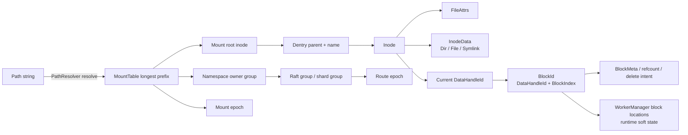

核心概念：

| 概念 | 代码位置 | 当前语义 |
| --- | --- | --- |
| `InodeId` | `types/src/ids.rs` | 命名空间对象的稳定 ID。 |
| `Inode` | `types/src/fs.rs` | 持久对象，包含 kind、attrs、data、mount_id、`current_data_handle_id`、xattrs。 |
| `Dentry` | `metadata/src/raft/storage.rs` API | parent inode + name 到 child inode 的映射，是 path resolve 的持久事实。 |
| `FileAttrs` | `types/src/fs.rs` | size、mode、uid/gid、mtime 等属性。 |
| `DataHandleId` | `types/src/ids.rs` | 数据实例 ID，不等于 file handle。`BlockId` 由 `DataHandleId + BlockIndex` 组成。 |
| `FileLayout` | `types/src/layout.rs` | 文件 block/chunk/replication 划分模型，不等于 `route_epoch`。 |
| `MountEntry` | `metadata/src/mount/mod.rs` | mount prefix、root inode、owner group、data IO policy、config version。 |
| `namespace_owner_group_id` | `MountEntry::namespace_owner_group_id` | namespace mutation 的 owner group。 |
| `shard_group_id` | `metadata/src/config.rs`、`types/src/ids.rs` | 当前 metadata 节点所属 raft/shard group。mount owner 可以指向 group。 |
| `mount_epoch` | `MountEntry::config_version` | mount 配置新鲜度。客户端携带旧值会触发 `MountEpochMismatch`。 |
| `route_epoch` | `RocksDBStorage::get_route_epoch()` | filesystem-facing 路由新鲜度。mount 创建/删除会推进；`AddShardGroup` 当前不推进。 |
| `state_id` | `common/src/header/types.rs`、`AppRaftNode::get_last_applied_state_id()` | 已应用 Raft state watermark。部分路径用它做 stale-state 检查。 |
| `file_handle` / write session | `metadata/src/service/fs_core/write_session.rs` | 运行时写会话身份，包含 lease、fencing、open_epoch、targets；不是持久 data handle。 |
| `fencing_token` | `types/src/lease.rs` | worker direct data path 与 metadata close/fsync 的一致性保护。 |

需要注意两个当前实现细节：

- `AppRaftStateMachine::apply_create()` 会为新文件分配持久 `current_data_handle_id` 并写入 data handle owner 映射。
- `WriteSessionCoordinator::execute_open_write()` 当前用 `DataHandleId::new(inode_id.as_raw())` 构造写目标 block id，而不是直接读取 inode 的 `current_data_handle_id`。这属于需要继续审计的历史包袱，维护时不能把它误读为已经完成的 data handle 生命周期模型。

## 6. 请求入口与服务分层

`FileSystemService` 是当前对外统一 path-first 入口。`FsCore` 是 service 内共享的 domain core；service 层负责 RPC 和策略适配，不应该承载复杂业务规则。当前代码里 `path_service.rs` 仍然偏大，但它的主流路径已经是：guard/authz/path resolve 后调用 `FsCore`。

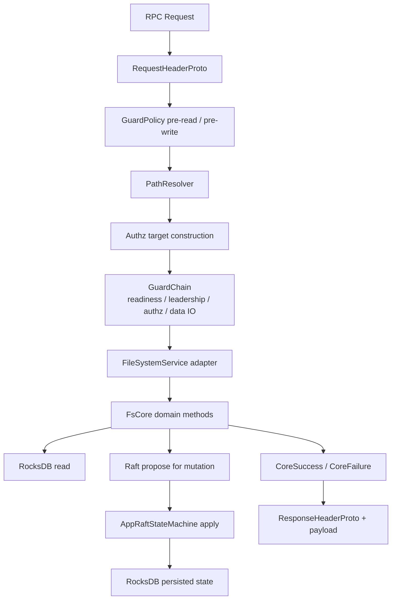

分层边界：

- proto 层：只定义 wire contract，例如 `RequestHeaderProto`、`ResponseHeaderProto`、`FileSystemServiceProto`、`MetadataWorkerServiceProto`。
- service 层：抽取 request context，执行 guard/authz/path resolve，构造 domain input，映射 header。
- domain core：执行 mount/route/session/fencing freshness、业务规则、dedup、Raft command orchestration。
- storage/Raft 层：持久化 authoritative state；Raft apply 是 mutation 的 commit boundary。
- worker manager：保存 heartbeat、block locations、full report sync 等运行时软状态，不应成为持久 namespace authority。

`GuardPolicy` 的职责是服务门禁，不是业务新鲜度：

| 检查 | 当前位置 | 说明 |
| --- | --- | --- |
| root readiness | `ReadinessGuard` | root 未 ready 返回 retryable canonical error。 |
| leadership | `LeadershipGuard` | 写路径或要求 leader 的数据 IO 路径返回 `NotLeader` refresh hint。 |
| authz | `AuthGuard` | 通过 `AuthzProvider` 检查 inode/session/path target。 |
| data IO policy | `DataIoPolicyGuard` | mount 标记 `DataIoPolicy::Forbid` 时拒绝数据 IO。 |
| mount/route freshness | `FsCore::FreshnessValidator` | 属于 domain consistency，不放在 guard。 |
| session/fencing/worker epoch | `WriteSessionCoordinator` | 属于写会话和直接数据路径一致性，不放在 guard。 |

## 7. 关键链路

### 7.1 Path Resolve / Lookup 链路

Path resolve 从字符串 path 开始，但 path 不落库为 authority。`PathResolver` 先调用 `MountTable` 做 longest-prefix match，确定 mount root 和 relative path；之后按 dentry 逐级读取 child inode。

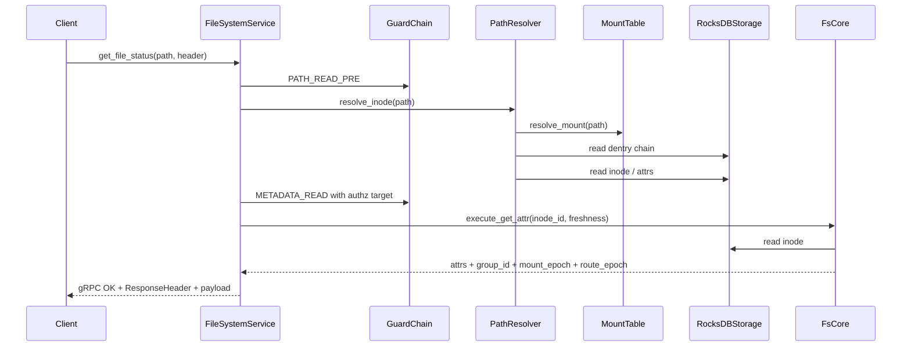

主要不变量：

- mount table 采用 longest-prefix；子 mount 覆盖父 mount。
- `PathResolver::resolve_rename()` 会拒绝跨 mount rename，返回 `CrossMountRename`，最终映射为 EXDEV。
- lookup/read 返回 header 中的 group、mount epoch、route epoch，用于客户端缓存和后续 refresh。
- `mount_epoch` 和 `route_epoch` 的实际校验在 `FsCore` freshness validator 中完成，service 不直接复写该逻辑。

### 7.2 Create / Mkdir / Delete / Rename 链路

namespace mutation 必须路由到 mount 的 owner group，并通过 Raft command 提交。`FsCore` 负责构造 dedup key、路由上下文和 command；`AppRaftStateMachine` 负责实际修改 RocksDB 中的 inode/dentry/layout/refcount。

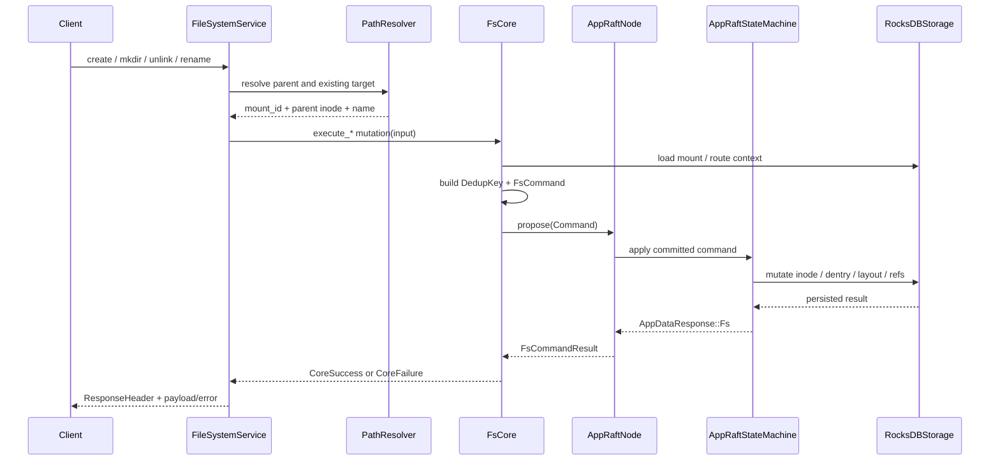

关键点：

- `route_fs_write_ctx()` 会确认多父目录操作位于同一 mount，并读取 `namespace_owner_group_id`。
- rename 的 cross-mount 情况在 resolver/core 之前被拒绝为 EXDEV，不走 UFS proxy 的 copy-delete fallback。
- rename 的逻辑原子性边界是一个 Raft command；当前 RocksDB apply 中仍有多次 CF 写操作，跨 CF/多 key 原子性需要继续审计。
- `DedupKey` 来自 `client_id + call_id`；fingerprint 排除 call_id，用于识别重复请求与冲突请求。

### 7.3 Open / Write Session / Fsync 链路

写路径分为 metadata 控制面和 worker 数据面。metadata 打开写会话、授予 lease/fencing、选择 worker targets；客户端后续直连 worker 写数据；`fsync` 或 `close_write_session` 再回到 metadata 完成提交或会话关闭。

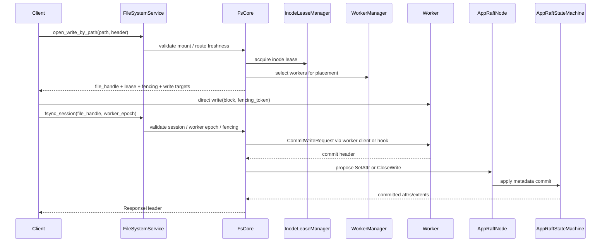

当前实现程度：

- `WriteSessionCoordinator` 维护内存会话；session 失效、过期或 fencing mismatch 会返回 `NEED_REFRESH`，reason 包括 `SessionInvalid`、`SessionExpired`、`Fencing`。
- `execute_fsync()` 会先调用 worker commit，再通过 `Command::SetAttr` 更新文件 size/mtime。
- `execute_close_write()` 校验 session、mount、route、worker epoch、lease、fencing、pending extents 后，通过 `Command::CloseWrite` 写入最终 extents 并释放 lease/session。
- 当前 `open_write` 的 data handle 选择仍需审计：写目标 block id 用 inode id 派生，而 create 时已有持久 `current_data_handle_id`。

### 7.4 GetBlockLocations / Read Route 链路

当前对外读路由接口主要是 `get_file_layout_by_path`。它返回文件 extents、file size 和 `FileBlockLocationProto` 列表，但当前 `FsCore::execute_get_file_layout()` 构造的 locations 中 worker 列表为空；真实 worker location 的内存权威在 `WorkerManager` 中，尚未完整接入该 read route 响应。

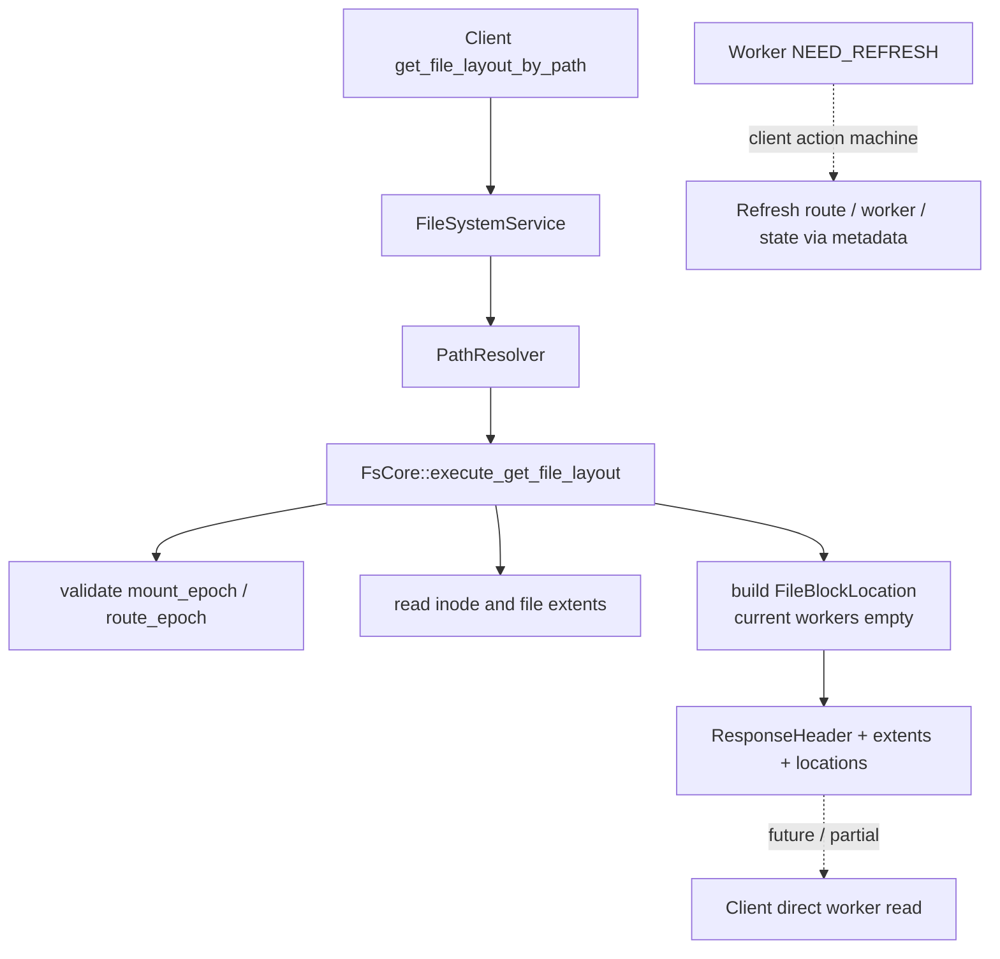

维护时必须区分：

- `types/src/layout.rs::FileLayout` 描述文件如何切分成 block/chunk，不是路由 epoch。
- `route_epoch` 是 metadata 返回给客户端的路由新鲜度，用于缓存刷新。
- worker 数据路径的 `worker_epoch`、`block_stamp`、fencing 校验在 worker direct data proto 和 worker 侧逻辑中完成，metadata 的 header 只负责触发 refresh/replay。

### 7.5 Mount 管理链路

mount 是 namespace ownership 和 UFS/IO policy 的边界。启动时 `MountTable::load_from_storage()` 从 RocksDB 恢复；Raft apply `CreateMount/DeleteMount` 后同步更新内存 `MountTable`。

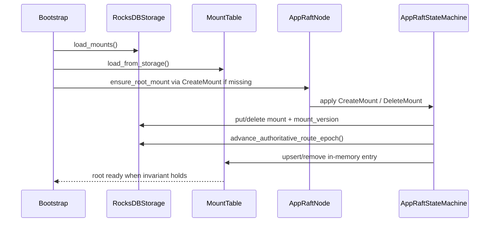

规则：

- root mount 是 internal、无 UFS URI、`DataIoPolicy::Forbid`。
- external mount 必须有 UFS URI；internal mount 不能有 UFS URI。
- child mount 通过更长 prefix 覆盖 parent mount。
- mount 创建/删除会推进 filesystem-facing route epoch；`AddShardGroup` 当前不会推进 route epoch。
- `MountTable::resolve_path()` 当前基于 normalized string prefix 匹配，prefix 边界需要继续审计，避免 `/mnt` 误匹配 `/mnt2` 这类路径。

### 7.6 Worker Heartbeat / Block Report 链路

worker 与 metadata 的关系分为持久 descriptor 和运行时软状态。注册时 descriptor 会通过 Raft 持久化；heartbeat、block report、full report sync、block locations 存在 `WorkerManager` 内存态，重启后需要 worker 重新上报。

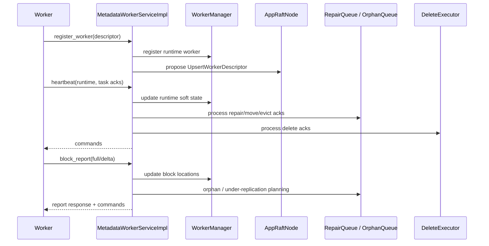

当前边界：

- `report_presence` 已 deprecated，当前只是 acknowledge/no-op；强一致 presence 应使用 block report。
- full report 有 lease/token 和 storm control；incremental report 需要 full sync 基线。
- block presence/location 是 runtime soft state，不是 Raft authoritative namespace state。
- worker descriptor 先写入 `WorkerManager` 内存再 propose Raft；如果 propose 失败，可能出现短暂内存/持久状态偏差，需要运维和测试关注。

### 7.7 Repair / Move / Evict 链路

repair 相关代码已经具备 planner、queue、heartbeat 下发、ack 推进、delete executor 和 maintenance gate，但整体仍是分阶段实现，不应写成完整自治 repair 系统已经完成。

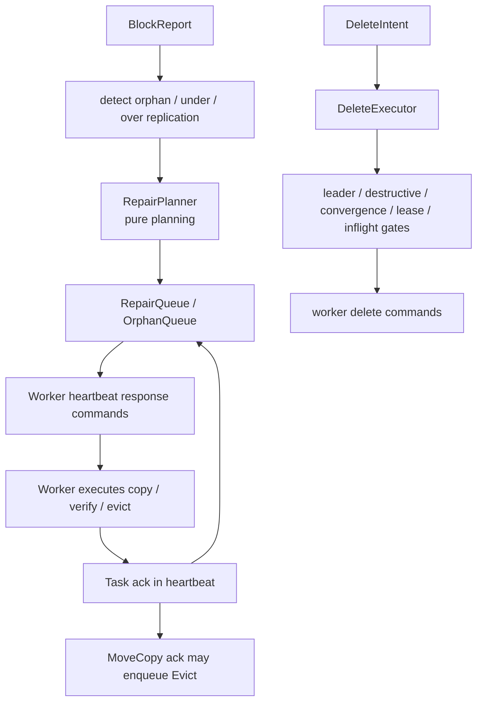

当前支持：

- `RepairPlanner` 根据 block location 和 candidate worker 做纯 planning，不直接访问 storage、raft 或 worker。
- `RepairQueue` 和 `OrphanQueue` 持有任务状态、lease/backoff/ack 推进。
- `MaintenanceService` 周期性运行 leader-only GC、lease cleanup、orphan cleanup、rebalance、timeout requeue、over-replication cleanup。
- `DeleteExecutor` 执行持久 delete intent，包含 leader、block report convergence、destructive gate、lease、inflight、per-worker concurrency 等安全门。

当前限制：

- replication factor 和 placement 策略仍偏 MVP，例如 write placement 中使用固定 `3`。
- delete intent 的执行状态部分直接写 RocksDB，不通过 Raft command。
- repair/move/evict 与真实 worker 数据复制、校验、失败恢复的端到端覆盖仍需继续补测试和收敛。

## 8. 错误模型与刷新闭环

Vecton 的错误模型以 `ResponseHeader.error` 为核心。recoverable business/protocol/consistency failure 使用 gRPC OK + `ResponseHeader.error`；transport/auth/framework failure 才使用 non-OK gRPC status。FileSystemService 的主流路径遵守这个模型；worker metadata service 中仍有少量 non-OK status，例如 heartbeat descriptor changed 使用 `failed_precondition`，注册失败路径也会返回 tonic `Status`。

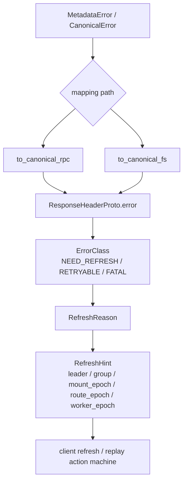

关键类型：

- `common/src/error/mod.rs::CanonicalError`
- `common/src/error/mod.rs::ErrorClass`
- `common/src/error/mod.rs::RefreshReason`
- `common/src/error/mod.rs::RefreshHint`
- `common/src/header/types.rs::ResponseHeader`
- `metadata/src/error.rs::to_canonical_rpc`
- `metadata/src/error.rs::to_canonical_fs`
- `metadata/src/service/core_util.rs::header_from_core_failure`

主要 refresh reason 边界：

| RefreshReason | 当前使用边界 |
| --- | --- |
| `NotLeader` | leadership guard 或 Raft propose/read 遇到 leader changed。 |
| `StaleState` | caller `state_id` 落后于当前 last_applied，部分写路径使用。 |
| `MountEpochMismatch` | request 或 route context 中的 mount epoch 与当前 mount config version 不一致。 |
| `RouteEpochMismatch` | request `route_epoch` 与 `StateStore::get_route_epoch()` 不一致。 |
| `WorkerEpochMismatch` | write session close/fsync 时 caller worker epoch 与 `WorkerManager` 当前 epoch 不一致。 |
| `BlockStampMismatch` | direct worker data path 使用；metadata header contract 保留该 reason。 |
| `Fencing` | write session fencing token、lease、open_epoch 不匹配。 |
| `SessionInvalid` / `SessionExpired` | file handle 或 write session 不存在、过期或已经终止。 |
| `Moved` | `core_util.rs` 中对 FileSystemService 显式 de-scope，当前不会作为主流路径返回。 |

client 侧 `client/src/canonical.rs` 会先区分 non-OK gRPC 和 OK response header error；`client/src/meta/rpc_helper.rs` 再把 reason 映射为 refresh 动作，例如 mount+route refresh、route refresh、worker refresh、fencing/session refresh、state refresh。维护 metadata 返回 header 时必须保证 `ErrorClass`、`RefreshReason`、`RefreshHint` 三者一致，否则 client 无法正确 replay。

## 9. Raft、RocksDB 与一致性

Raft 是 authoritative mutation 的提交边界；RocksDB 是 committed state 的持久化承载。`AppRaftStateMachine` 只在 command commit 后 apply mutation，并把结果写入 RocksDB。

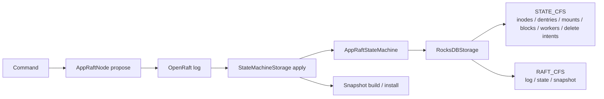

持久状态：

- inode、dentry、attrs、file extents、file layout、data handle owner。
- mount entries、mount version、route epoch。
- block metadata、block refcount、leases、delete intents。
- shard groups、shard routing。
- worker descriptor 和部分 legacy worker info。
- dedup applied result、applied seq、raft log/state/snapshot。

运行时 ephemeral 状态：

- `WorkerManager` 中的 heartbeat runtime、block locations、sync state、metadata epoch。
- write sessions、inode lease manager 的活跃 lease。
- repair/orphan queues、inflight registry、full report lease manager。
- readiness watcher、health serving 状态。

当前实现程度：

- `metadata/src/raft/state_machine_store.rs` 已有 snapshot build/install，snapshot payload 来自 replicated state CF，并携带 route epoch/applied seq。
- `RaftStateStore` 的 read 当前调用 `AppRaftNode::read(false, ...)`，也就是 leader-read 检查；代码中存在 `read(true)` 能力，但主流 StateStore 读不是 follower read。
- `state_id` 和 stale-state validation 已存在，但不是所有 read/write 都强制使用。
- 部分维护状态例如 delete intent execution status 会直接写 RocksDB，不通过 Raft command；这是当前实现事实和后续收敛点。

## 10. 与其他模块的关系

| 模块 | metadata 依赖方式 | 边界 |
| --- | --- | --- |
| `common` | 使用 config、header、canonical error、metrics/tracing 基础设施 | metadata 可以映射错误和填充 header，但不能改变 common 的跨模块语义。 |
| `types` | 使用 inode、block、layout、lease、worker、mount/routing ID 等强类型 | domain model 的 authority 在 types；metadata 不应引入松散字符串替代强类型。 |
| `proto` | 实现 `FileSystemServiceProto` 和 `MetadataWorkerServiceProto`，消费 proto DTO | proto 是 wire contract；业务逻辑应尽快转换到 domain 类型。 |
| `client` | metadata 返回 header、refresh hint、layout/write session 信息供 client action machine 使用 | metadata 不直接执行 client refresh，只提供可解释的 reason/hint。 |
| `worker` | worker 通过 register/heartbeat/block_report 与 metadata 通信；client direct data path 使用 worker data proto | metadata 不做 chunk IO，不持有 worker 本地存储布局 authority。 |
| `transport` | 当前主要由 tonic/proto server/client 承载 RPC；transport 抽象不应渗透到 domain core | framework/transport failure 才使用 non-OK gRPC status。 |
| `ufs` | runtime 构造 registry/proxy，mount entry 可携带 UFS URI | 当前 FileSystemService 主路径尚未真正把 UFS metadata proxy 作为 namespace 执行后端。 |

## 11. 已完成的架构整理

基于当前代码，可以确认已经完成的整理：

| 整理项 | 当前代码证据 | 说明 |
| --- | --- | --- |
| `main.rs` 变薄 | `metadata/src/bin/main.rs` | 入口只串联 runtime 阶段。 |
| runtime composition 函数拆分 | `metadata/src/runtime.rs` | config、observability、authority、worker manager、worker service、worker background、maintenance、readiness、RPC composition、serve 分离。 |
| worker manager / service / background 分离 | `WorkerManager`、`WorkerService`、`WorkerBackground` | worker 是 required runtime component；worker service 始终注册，heavy background 在 authority ready 后启动。 |
| maintenance / readiness 与 worker background 分离 | `Maintenance`、`Readiness`、`RuntimeHandles` | maintenance/delete/lease cleanup 不再藏在泛化 background runtime；readiness/health watcher 独立持有；后台循环已有 JoinHandle 持有，但 graceful shutdown 仍待补齐。 |
| `FsCore` 抽出 | `metadata/src/service/fs_core/` | read、mutation、freshness、write session 已成子模块。 |
| error contract 集中 | `metadata/src/error.rs`、`metadata/src/service/core_util.rs` | 显式 `to_canonical_rpc/fs` 与 header helpers。 |
| guard policy 统一 | `metadata/src/service/guard.rs` | `GuardPolicy` constants 加 `guard_policy()` 调用路径。 |
| MountTable 启动加载和 Raft apply 同步 | `MountTable::load_from_storage()`、`apply_create_mount()` | mount 内存表不是孤立 runtime 配置。 |
| MOVED de-scope | `metadata/src/service/core_util.rs` | FileSystemService 遇到 MOVED reason 会降级为 unknown/unsupported path。 |
| ACL MVP | `metadata/src/service/authz.rs` | `AclInodeAuthz` 基于 inode xattr；default ACL inheritance 等尚未完成。 |

不能写成已完成的能力：

- 没有独立 Rust `InodeService` 服务实现；只有 proto 注释/历史接口痕迹。
- `GetFileLayoutByPath` 当前没有完整返回 worker locations。
- Ranger provider 当前是 allow-all stub。
- UFS proxy 当前未接入 FileSystemService 主读写路径。
- repair/move/evict 具备框架和部分执行链路，但还不是完整自治 repair 系统。
- follower read/state watermark 不是全路径强制语义。

## 12. 当前风险、历史包袱与 TODO

| 风险/包袱 | 当前表现 | 影响 | 建议 |
| --- | --- | --- | --- |
| write session data handle 语义不一致 | `execute_open_write()` 用 inode id 派生 `DataHandleId`，而 create 时已有持久 `current_data_handle_id` | block id、data handle owner、file layout 生命周期可能不一致 | 审计 open/close/write target 与 `current_data_handle_id`，统一数据实例来源。 |
| inode id allocator 持久化风险 | `AppRaftStateMachine::next_inode_id` 当前内存从 1 开始 | 重启或 snapshot restore 后可能出现 ID 重用风险，除非外部路径已保证恢复 | 增加持久 allocator 或启动时从 RocksDB 恢复 max inode id，并补 crash/restart 测试。 |
| read route locations 未完整接入 | `execute_get_file_layout()` 返回的 `FileBlockLocation.workers` 为空 | client 无法仅凭 metadata response 完成完整 read route | 接入 `WorkerManager` location 或明确改造 read route API。 |
| mount prefix 边界需审计 | `MountTable::resolve_path()` 基于 normalized string prefix | `/mnt` 与 `/mnt2` 这类边界可能误匹配 | 使用 path component 边界匹配并补测试。 |
| RocksDB 多 key/多 CF apply 原子性 | state machine 多处按步骤调用 storage put/delete | apply 过程中 crash 可能留下部分状态，需确认 RocksDB batch 边界 | 对 namespace mutation 使用 write batch 或补 recovery invariant 校验。 |
| Ranger authz 是 stub | `StubRangerAuthz` allow-all 并记录 debug | 配置 Ranger 模式不会真正执行策略 | 明确生产禁用或实现真实 Ranger provider。 |
| UFS proxy 未接入主路径 | runtime 构造 `_ufs_registry` 和 `_ufs_metadata_proxy`，FileSystemService 不使用 | external mount 的 metadata 行为不完整 | 明确 external mount MVP 范围，接入或移除未使用路径。 |
| worker register 内存先行 | `register_worker` 先更新 `WorkerManager`，再 propose descriptor | Raft propose 失败时可能产生短暂内存/持久偏差 | 调整顺序或在失败时回滚内存态。 |
| delete intent 状态直接写 RocksDB | `DeleteExecutor` 执行状态不通过 Raft command | 多副本一致性和 failover 语义需要额外证明 | 将状态推进纳入 Raft 或记录为明确的 leader-local runtime 状态。 |
| repair 策略仍是 MVP | placement/replication factor 局部硬编码，端到端覆盖不足 | 过度相信 repair 可能导致副本不足或误删 | 明确最小支持集，补端到端 repair/move/evict 测试。 |
| `path_service.rs` 仍然偏大 | RPC、guard、authz target、转换和少量流程控制集中 | 新增 RPC 容易把业务重新写回 service 层 | 继续按 operation family 拆 adapter，但保持 `FsCore` 为业务归属。 |
| client path 到 group 解析未完成 | `client/src/meta/rpc_helper.rs::resolve_path_to_group()` 返回 `None` | route cache 和 replay 还没有完整 path/group 闭环 | 完成 path route cache 或让 metadata response 提供足够 hint。 |
| `report_presence` 历史接口残留 | worker service 中 deprecated no-op | 调用方可能误以为 presence 已被 authoritative 记录 | 删除内部调用，文档和 proto 标注迁移到 block report。 |

## 13. 开发不变量与贡献指南

后续修改 metadata 时必须遵守：

- path 是 adapter，不是 authority；不要新增以 path 为持久真相的状态。
- inode、dentry、attrs 是文件系统 metadata authority。
- Block 是管理、reporting、replication、delete intent 单元；Chunk 是 worker 本地 IO/checksum/repair 单元。
- `data_handle_id`、`file_handle`、write session、lease 语义不可混淆。
- recoverable business/protocol/consistency error 不直接返回 non-OK gRPC；应返回 gRPC OK + `ResponseHeader.error`。
- `mount_epoch`、`route_epoch`、`state_id`、`worker_epoch`、fencing token 必须保持一致性闭环。
- guard 只做 service gate；mount/route/session/fencing freshness 属于 domain core。
- worker runtime 和 background runtime 不能反向偷取 namespace authority；worker soft state 丢失后必须能通过 report/heartbeat 收敛。
- service 层保持薄；新增业务规则优先放入 `FsCore` 或 state machine。
- 内部 legacy code 优先删除，不做兼容桥；如果 proto 兼容必须保留，应在注释和 README 中标明边界。
- 修改 proto/types 时同步更新 mapping、tests、client refresh/replay、README。
- 新增请求必须明确经过 readiness、authz、leadership、data IO policy 和 domain freshness 策略。
- 修改 Raft apply 时必须说明 commit boundary、dedup、snapshot/recovery 和 RocksDB 原子性。

## 14. 快速阅读路径

建议新开发者按以下顺序阅读：

1. `metadata/src/bin/main.rs`：确认真实入口和 runtime 阶段顺序。
2. `metadata/src/runtime.rs`：理解 core、authority、worker、background、filesystem、serve 的组装边界。
3. `metadata/src/bootstrap.rs` 和 `metadata/src/mount/mod.rs`：理解 root mount、mount table、mount epoch、owner group。
4. `metadata/src/service/path_service.rs`：看一个完整 RPC 如何从 header、guard、path resolve 进入 `FsCore`。
5. `metadata/src/service/guard.rs`、`metadata/src/service/authz.rs`、`metadata/src/service/core_util.rs`：理解门禁、授权和 header/error 映射。
6. `metadata/src/service/fs_core/mod.rs`、`freshness.rs`、`mutation.rs`、`read.rs`、`write_session.rs`：理解 domain core 的职责边界。
7. `metadata/src/path_resolver.rs`：理解 path 只是 inode/dentry/mount 的解析适配。
8. `metadata/src/raft/command.rs`、`metadata/src/raft/state_machine.rs`：理解所有 authoritative mutation 的命令和 apply 语义。
9. `metadata/src/raft/storage.rs`、`metadata/src/raft/state_machine_store.rs`、`metadata/src/state/raft_store.rs`：理解 RocksDB schema、Raft state、snapshot、StateStore。
10. `metadata/src/worker/service.rs`、`metadata/src/worker/manager.rs`、`metadata/src/worker/repair/`：理解 worker descriptor、heartbeat、block report、repair 任务。
11. `metadata/src/maintenance/` 和 `metadata/src/worker/delete_executor.rs`：理解后台 GC、lease cleanup、orphan/overrep、delete intent 执行安全门。
12. `proto/metadata/filesystem.proto`、`proto/metadata/worker.proto`、`proto/common/header.proto`、`proto/common/errors.proto`：对照 wire contract。
13. `types/src/fs.rs`、`types/src/ids.rs`、`types/src/block.rs`、`types/src/layout.rs`、`types/src/lease.rs`：理解强类型模型。
14. `client/src/canonical.rs`、`client/src/meta/rpc_helper.rs`、`client/src/meta/filesystem.rs`：理解 metadata header 如何驱动 client refresh/replay。

阅读时优先从真实入口和当前代码流出发。`docs/` 目录如果存在相关设计文档，只能作为背景材料；最终判断以 `AGENTS.md` 和当前代码为准。
