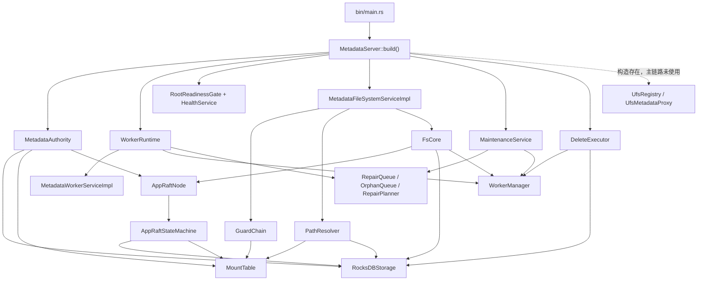
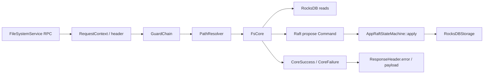

# Vecton Metadata 当前实现说明

本文只描述当前仓库代码已经落地的 `metadata` 实现。未闭环能力会明确标为“未实现”“部分实现”“历史残留”或“设计目标”，不要把本文当作未来设计承诺。

## 1. Metadata 当前定位

`metadata` 是 Vecton 的文件系统元数据权威面，负责 inode、dentry、attrs、mount、Raft mutation、worker descriptor、block metadata、delete intent 和请求一致性错误语义。

`metadata` 不做数据面 IO。读写数据应由 client 直接访问 worker；metadata 只返回或维护数据路径所需的控制面信息，例如 layout、write session、fencing token、block metadata、worker soft state 和 refresh hint。

当前主链路是：

- 进程启动：`metadata/src/bin/main.rs` -> `metadata/src/runtime.rs::MetadataServer::build()` -> `serve()`。
- 文件系统 RPC：`MetadataFileSystemServiceImpl` -> `GuardChain` / `PathResolver` -> `FsCore` -> `AppRaftNode` / `RocksDBStorage`。
- worker metadata RPC：`MetadataWorkerServiceImpl` 处理 register、heartbeat、block report、task ack。
- 后台任务：`MaintenanceService`、`DeleteExecutor`、worker background tasks 在同一进程内启动并由 `RuntimeHandles` 持有。

当前非主链路或未闭环能力包括：UFS metadata proxy、ACL/Ranger authz、完整 direct-read worker route、完整 repair/move/evict/rebalance 自治闭环、多 shard migration、follower read 全路径语义。

## 2. 当前实现总览

图中实线是当前已接入主链路或启动链路的对象；虚线表示 runtime 已构造但 FileSystemService namespace read/write 主路径未使用。

## 3. 启动链路

`metadata/src/bin/main.rs` 仍是薄入口。它只调用：

1. `load_config()`
2. `init_observability(config.as_ref())`
3. `MetadataServer::build(config).await`
4. `server.serve().await`

`MetadataServer::build()` 当前实际构造的长期对象：

| 阶段 | 输入 | 输出 | 副作用 | 边界 |
| --- | --- | --- | --- | --- |
| `load_config()` | `VECTON_CONFIG` 或 `conf/core-site.yaml` | `Arc<MetadataConfig>` | 读取配置 | 不构造 runtime。 |
| `init_observability()` | `MetadataConfig` | `Observability` | 初始化 tracing/metrics guard | 只保活观测资源。 |
| `build_authority()` | config | `MetadataAuthority` | 打开 RocksDB，加载 `MountTable`，构造 `AppRaftStateMachine` / `AppRaftNode`，执行 root mount bootstrap，构造 `RaftStateStore`、UFS registry/proxy | authority bootstrap 顺序仍是 `RocksDBStorage -> MountTable -> AppRaftStateMachine -> AppRaftNode -> ensure_root_mount -> RaftStateStore`。 |
| `build_worker_runtime()` | config、authority | `WorkerRuntime`、`MetadataWorkerServiceImpl` | 创建 `WorkerManager`、repair/orphan queue、planner，初始化 metadata epoch | worker 是 required component，不存在 optional/disabled worker runtime。 |
| `build_readiness()` | config、authority | `Readiness` | 启动 root readiness watcher，创建 HealthService | readiness gate 被 FileSystemService guard 使用。 |
| `build_filesystem_service()` | config、authority、worker manager、readiness | `MetadataFileSystemServiceImpl` | 创建 write session manager、inode lease manager、worker commit hook、permission checker、FsCore、GuardChain | 只构造 filesystem RPC service，不启动 server。 |
| `build_maintenance()` | authority、worker runtime | `Maintenance` | 启动 lease runtime、MaintenanceService、DeleteExecutor | 后台维护能力同进程运行。 |
| `build_worker_background()` | worker runtime、worker service、maintenance | `WorkerBackground` | 给 worker service 注入 DeleteExecutor，启动 worker background tasks | 启动 worker 相关后台循环。 |
| `compose_services()` | filesystem、worker、readiness、background、maintenance | `RpcServices`、`RuntimeHandles` | 无新增启动副作用 | 分离可注册 RPC service 和需保活 handle。 |
| `serve()` | config、services、handles | gRPC server | 注册 FileSystemService、MetadataWorkerService、HealthService，等待 Ctrl-C/SIGTERM | 只负责注册和持有 handles，不构造 runtime。 |

`RuntimeHandles` 当前持有 `WorkerBackgroundHandle`、`MaintenanceHandle`、`DeleteExecutorHandle`、`ReadinessHandle`，语义是保留后台 `JoinHandle`。代码没有 cancellation token、逐 task stop 或 join 流程，因此不能写成完整 graceful shutdown；目前只是 server shutdown 后进程/Tokio runtime 结束后台循环。

root mount bootstrap 当前行为：

- 若已有 `/` mount，必须满足 `ROOT_INODE_ID`、`MountKind::Internal`、无 `ufs_uri`、`DataIoPolicy::Forbid`。
- 若缺失且当前节点是 leader，通过 `Command::CreateMount` 创建。
- 若当前节点不是 leader，`ensure_root_mount()` 直接返回，后续由 readiness watcher 持续等待/尝试。
- root mount 不能删除。

## 4. 请求主链路

当前对外 filesystem RPC 入口是 `MetadataFileSystemServiceImpl`，实现 `proto::metadata::FileSystemServiceProto`。`proto/metadata/filesystem.proto` 中关于 “external clients should not call InodeService directly” 的注释是历史痕迹；当前 `metadata/src/service` 没有独立 Rust `InodeService` 服务实现。

`path_service.rs` 仍然偏大。它当前承担的 adapter 职责包括：tonic request/response、header/context 提取、guard 调用、path resolve、permission target 选择、proto/domain 转换、FsCore 调用、ResponseHeader 构造。核心 freshness、session、lease、fencing、mutation orchestration 已在 `FsCore` 内，但 adapter 还不是很薄。

`FsCore` 当前子模块：

- `mod.rs`：共享 core state、route/write context、dedup、error/header helper、Raft propose 辅助。
- `read.rs`：getattr、readdir、xattr、layout、statfs/access/symlink 等读类或未实现方法。
- `mutation.rs`：create、mkdir、unlink、rmdir、rename、setattr、xattr、mount mutation 等。
- `write_session.rs`：open/renew/release/close/fsync/hsync/hflush/truncate write session 链路。
- `freshness.rs`：mount_epoch、route_epoch、state_id 校验。
- `tests.rs`：FsCore 局部合同测试。

Guard 链路当前实际生效内容：

- `check_meta_read()`：readiness。
- `check_meta_write()`：readiness + leadership。
- `check_data_read()`：readiness + data IO policy。
- `check_data_write()`：readiness + leadership + data IO policy。
- `check_perm()` / `check_parent_perm()` / `check_super()` / `check_set_attr_perm()`：委托 `PermissionChecker`。

mount/route/session/fencing freshness 仍在 `FsCore` / `WriteSessionCoordinator`，不在 guard 中。`GuardChain` 不检查 `mount_epoch`、`route_epoch`、`state_id`、write session、lease、fencing token 或 `worker_epoch`。

Authz 当前状态：

- 配置枚举包含 `NONE`、`ACL`、`RANGER`。
- 当前可启用实现只有 `NONE`，行为是 allow-all，并记录 `AUTHZ_ALLOW_NONE_TOTAL`。
- `ACL` 和 `RANGER` 在 `filesystem_permission_checker()` 中直接返回 `InvalidArgument`，不是 ACL MVP，也不是 Ranger allow-all stub。

`MOVED` 当前仍被 FileSystemService de-scope。`core_util.rs` 明确把 `RefreshReason::Moved` 映射成 `RefreshReasonUnknown`，client 侧也把 `ShardMoved` code 映射为 `RouteEpochMismatch` 行为。

## 5. Authority model

metadata 当前 authority 是 inode-centric：

- inode 是文件系统对象身份。
- dentry 是 parent inode + name 到 child inode 的持久映射。
- attrs 是 inode 属性事实。
- path 只是 `PathResolver` 的输入适配，不是持久 authority。

mount / owner group / route epoch：

- `MountTable` 启动时从 RocksDB `mounts` CF 加载，Raft apply `CreateMount` / `DeleteMount` 后同步更新内存表。
- `MountEntry::namespace_owner_group_id` 是 mount 内 namespace mutation owner group。
- `mount_epoch` 使用 `MountEntry::config_version`。
- `route_epoch` 存在 RocksDB `meta` CF 中，`CreateMount` / `DeleteMount` 会推进；`AddShardGroup` 当前不推进 filesystem-facing `route_epoch`。
- `state_id` 来自 Raft applied state watermark，部分 header 和 stale-state 路径会使用。

data identity / session identity：

- `data_handle_id` 是数据面身份，`BlockId = data_handle_id + block_index`。
- `file_handle` 是 write session 身份，不是持久文件身份。
- `fencing_token` 保护 direct client->worker 与 close/fsync 的一致性。
- `Create` 当前会通过持久 `next_data_handle_id` 分配 `current_data_handle_id` 并写入 `data_handle_owner` 映射。
- 当前风险：`WriteSessionCoordinator::execute_open_write()` 仍用 `DataHandleId::new(inode_id.as_raw())` 生成 block id，而不是使用 inode 上的 `current_data_handle_id`。这说明 data handle 生命周期尚未统一。

block metadata 与 worker soft state 边界：

- block metadata、lease、block refcount、delete intent 是 RocksDB/Raft 管理状态。
- worker descriptor 通过 `Command::UpsertWorkerDescriptor` 持久化。
- heartbeat、capacity/load、block locations、full-report sync state 是 `WorkerManager` 内存软状态。

Raft / RocksDB 现状：

- 主 filesystem mutation、mount mutation、worker descriptor、delete intent 创建都通过 `Command` propose 到 Raft apply。
- 仍存在直接 RocksDB 写路径：worker identity/worker id allocator 在 register 前经 leader read 取得 storage 后直接写；delete intent 状态更新由 `DeleteExecutor` 直接写 RocksDB；block refcount helper 和一些 maintenance 兼容方法直接写 RocksDB。
- `RaftStateStore` 读调用 `AppRaftNode::read(false, ...)`，当前是 leader-read 检查，不是 follower read；`AppRaftNode::read(true, ...)` 有 linearizable read 分支，但主 `RaftStateStore` 路径没有使用。
- snapshot build/install 基于 `STATE_CFS` 的 RocksDB snapshot/payload，包含 replicated state CF；install 时先 clear 对应 CF，再批量恢复。
- 多 key/多 CF mutation 没有统一 batch 原子性。部分 allocator/snapshot 使用 `WriteBatch`，但 create/mkdir/rename/close_write 等 state machine apply 中仍有多个连续 `put_*` / `delete_*`。
- inode id allocator 仍是 `AppRaftStateMachine::next_inode_id` 内存计数器，未持久化，属于高优先级 correctness 风险。

## 6. Worker metadata 链路

worker RPC 入口是 `MetadataWorkerServiceImpl`。

register 当前行为：

- 根据 endpoint + labels 计算 identity。
- 如果没有 suggested worker id，先通过 state machine storage 的 `get_worker_id_by_identity()` / `get_and_increment_worker_id()` / `put_worker_identity()` 直接生成和写入 worker id 映射。
- 先调用 `WorkerManager::register_worker()` 写入内存 descriptor。
- 再 propose `Command::UpsertWorkerDescriptor` 持久化 descriptor。

这仍是“先内存后 Raft”的顺序。如果 Raft propose 失败，内存 descriptor 可能短暂领先持久状态。

heartbeat 当前行为：

- 所有节点都更新 `WorkerManager` runtime soft state，不走 Raft。
- leader 检测 descriptor 变化会返回 non-OK gRPC `failed_precondition` 要求 re-register。
- leader 分配 full block report lease，处理 task ack，并从 DeleteExecutor/RepairQueue 拉取 worker command。
- follower 不分配 full report lease，不下发 repair/delete command。

block report 当前行为：

- full report 需要在 worker 需要 full sync 时携带 lease token。
- full report 替换该 worker 的 block set；incremental report 在已有 full sync 基础上应用 delta。
- block locations 是 `WorkerManager` 内存 soft state，不通过 Raft 持久化。
- leader 对新增 block 做 orphan 检测和 replication planning。
- `report_presence` RPC 仍存在，是 deprecated/no-op；强一致 presence 来源是 `block_report`。

task ack 当前行为：

- heartbeat 中携带 `TaskAckProto`。
- DeleteExecutor 先尝试按 task id 处理 delete ack。
- RepairQueue 再处理 replicate/move_copy/evict ack；MoveCopy 成功会 enqueue follow-up Evict task。

## 7. Maintenance / Repair / Delete 当前状态

`MaintenanceService::start()` 当前启动 7 个后台任务：

- GC task。
- GC refcount reload self-healing。
- lease cleanup。
- orphan cleanup。
- rebalance task。
- repair timeout requeue。
- over-replication cleanup。

这些任务都是 leader-only 执行核心动作，但模块成熟度不同：

- 已接入：MaintenanceService 在 runtime 启动，DeleteExecutor 在 runtime 启动并接入 worker heartbeat command/ack。
- 部分闭环：GC/orphan/overrep 可以创建 delete intent，DeleteExecutor 可读取 pending intents、执行 destructive gate、生成 `DeleteBlocksCommandProto`，并根据 ack + 后续 block report reconcile 更新状态。
- 框架/部分闭环：RepairPlanner/RepairQueue 支持 Replicate、MoveCopy、Evict 的 planning、queue、dispatch、ack/backoff；实际 copy/verify/evict 是否端到端成功取决于 worker 实现和数据面配合，metadata 侧不能单独证明完整自治 repair。
- MVP/硬编码：replication factor 多处仍硬编码为 `3u8`；rebalance 是简单 load heuristic；placement/fault-domain 策略未闭环。
- 直接 RocksDB：DeleteExecutor 的 Completed/Failed 状态通过 `storage.update_delete_intent_status()` 直接写 RocksDB，不是新的 Raft command。

建议文档和瘦身时把 maintenance 作为“可保留框架、默认保守运行或可降级”的后台能力，不要描述成完整自治 repair 系统。

## 8. UFS 与 External Mount 当前状态

runtime 当前构造了 `UfsRegistry` 和 `UfsMetadataProxy`，并把它们保存在 `MetadataAuthority` 私有字段里。

`MountKind::External` 和 `ufs_uri` 可以通过 mount entry 表达，`MountTable::resolve_path()` 可以把统一路径映射到 UFS URI + relative path。`UfsMetadataProxy` 也实现了 stat/list/rename/delete/exists 等代理方法。

但 FileSystemService 主路径没有注入或调用 `UfsMetadataProxy`。当前 namespace read/write 仍走 inode/dentry/attrs/Raft/RocksDB 链路；external mount 只在 mount metadata 和 data IO policy 层部分存在，不能写成已经支持完整 UFS-backed namespace。

当前必须明确的边界：UFS proxy 构造存在，但 namespace read/write 主链路未使用。

## 9. Error model 与 refresh 闭环

当前 wire contract 仍是：

- recoverable business/protocol/consistency failure 使用 gRPC OK + `ResponseHeader.error`。
- transport/auth/framework failure 使用 non-OK gRPC status。

metadata 侧：

- `metadata/src/error.rs` 把 `MetadataError` 显式映射为 canonical error。
- `LeaderChanged`、`MountEpochMismatch`、`RoutingStale`、`StaleState`、`LeaseFenced`、`ServiceUnavailable` 等会变成可机器处理的 header error。
- FileSystemService handler 多数错误走 response header；部分 worker RPC 输入错误和 descriptor changed 使用 non-OK gRPC status。

client 侧：

- `client/src/canonical.rs` 明确解析 non-OK gRPC、gRPC OK + header error、gRPC OK + no error 三种 envelope。
- `client/src/meta/filesystem.rs` 的 action machine 根据 `RefreshReason` 做 route/mount/worker/session refresh/replay。
- `client/src/meta/rpc_helper.rs::resolve_path_to_group()` 仍返回 `None`，group route 尚未完成。
- mount refresh 没有专用 API，当前 fallback 到 route/status refresh。
- `GetFileLayoutByPath` 可返回 `route_epoch`/`mount_epoch` hint，但 worker locations 当前为空，因此 direct-read worker route hint 不完整。
- MOVED 仍 de-scope，`ShardMoved` 只走 route refresh 行为。

## 10. 当前已完成整理

以下只列当前代码事实已经完成的整理：

- `main.rs` 已保持薄入口，runtime composition 集中在 `metadata/src/runtime.rs`。
- `MetadataServer::build()` 统一构造 authority、required worker runtime、readiness、filesystem service、maintenance、worker background、services 和 runtime handles。
- worker runtime 不是 optional subsystem。
- `RuntimeHandles` 持有后台 task handles，但未实现完整 graceful shutdown。
- FileSystemService 对外入口统一为 `MetadataFileSystemServiceImpl`。
- `FsCore` 已拆成 read/mutation/write_session/freshness 子模块。
- `GuardChain` 与 domain freshness 分离：guard 做 readiness/leadership/data IO/authz，mount/route/session/fencing 在 FsCore。
- `MOVED` 在 FileSystemService 中显式 de-scope。
- worker descriptor 与 heartbeat/block location 的持久态/软状态边界已在代码中分离。
- block report 是当前 block presence 主来源；`report_presence` 只是 deprecated/no-op。

## 11. 当前风险、历史包袱、TODO

高优先级 correctness 风险：

- `data_handle_id / open_write`：create 使用持久 data_handle allocator，但 open_write 仍用 `inode_id` 派生 `DataHandleId`，data handle 生命周期未统一。
- inode id allocator：`next_inode_id` 是 state machine 内存计数器，未从 RocksDB/Raft snapshot 恢复，重启后有重复分配风险。
- RocksDB multi-key/multi-CF 原子性：create/mkdir/rename/close_write 等 mutation 仍由多个 `put_*` 组成，没有统一 batch 原子提交。
- worker register 顺序：先写 `WorkerManager` 内存 descriptor，再 propose Raft；失败时内存与持久状态可能短暂不一致。
- delete intent 执行状态：Completed/Failed 由 DeleteExecutor 直接写 RocksDB，不走 Raft command。

当前实现限制：

- `get_file_layout_by_path` 返回 extents 和 `FileBlockLocation`，但 `workers` 为空、`worker_epoch` 为 None，不能支撑完整 direct client-read route。
- mount prefix 边界：`PathResolver` 和 `MountTable::resolve_path()` 都使用 `starts_with` 做 prefix 匹配，`/mnt/s3x` 误匹配 `/mnt/s3` 的边界风险仍需修复。
- ACL/Ranger：配置枚举存在，但两者均未实现且 fail fast；不要写成 ACL MVP 或 Ranger stub。
- UFS proxy：runtime 构造存在，FileSystemService 主链路未使用。
- repair/move/evict：metadata 侧有 planner/queue/command/ack 框架，但不能证明完整端到端 repair 系统已经闭环。
- over-rep cleanup/rebalance：任务已启动，但策略仍简单，默认 replication factor 仍多处硬编码。
- report_presence：RPC 仍残留，但 deprecated/no-op。
- client path/group route：`resolve_path_to_group()` 仍返回 None；route refresh/replay 能力仍不完整。
- route owner group / namespace owner group：namespace owner group 参与 write route context 和 header hint；多 group 实际转发/迁移不是完整闭环。
- external mount：mount metadata 支持 external 表达，但 namespace 操作仍不代理到 UFS。
- follower read：代码有 linearizable read 分支，但主 `RaftStateStore` 使用 leader-read；follower read 全路径语义未落地。

## 12. Metadata 瘦身建议

P0：必须保留并优先修正的主链路 correctness。

- 保留 `FsCore`、`PathResolver`、`MountTable`、`AppRaftStateMachine`、`RocksDBStorage`、`RaftStateStore`、`ResponseHeader.error` contract、write session/fencing 主链路。
- 优先修正 inode id allocator 持久化。
- 统一 data_handle_id 生命周期，特别是 open_write 不能继续用 inode_id 派生 data handle。
- 修复 mount prefix 边界。
- 收敛 create/mkdir/rename/close_write/delete-intent 状态等多 key RocksDB mutation 的原子性。
- 明确 worker register 内存/持久顺序，避免 register 失败后内存状态误导 heartbeat。

P1：最小读写闭环。

- 保留 FileSystemService path-first RPC、guard、readiness、leadership、NONE authz、mount/route/session freshness。
- 保留 create/mkdir/unlink/rmdir/rename/setattr/xattr/open_write/fsync/close 的最小链路。
- `get_file_layout_by_path` 先如实返回 extents/epoch；worker locations 未闭环前不要作为完整 direct-read route。
- client action machine 保留 refresh/replay，但承认 path->group route 和 mount refresh API 未完成。

P2：可保留框架但默认关闭或降级的后台维护能力。

- MaintenanceService、RepairQueue、OrphanQueue、RepairPlanner、DeleteExecutor 可以保留为框架，但生产默认策略应保守。
- GC、orphan cleanup、over-rep cleanup、rebalance、repair timeout requeue 可按风险分级启用。
- DeleteExecutor 已能下发 delete command，但状态绕过 Raft，应在高风险环境中谨慎开启 destructive path。
- replication factor、placement、fault-domain、rebalance 策略可以先保持 MVP，不要扩展成复杂策略。

P3：暂缓实现的高级能力。

- Ranger。
- 完整 ACL。
- UFS metadata proxy 接入 FileSystemService 主路径。
- 完整 repair/move/evict 端到端自治系统。
- over-rep cleanup 的完整策略化。
- rebalance 的生产级调度。
- 多 shard migration。
- follower read 全路径语义。
- dedicated mount refresh API 和完整 path/group route cache。

不能为了瘦身删除的模块或合同：

- `FsCore`，因为它承载 domain freshness、mutation、write session/fencing。
- `MountTable`，因为 mount resolve、mount_epoch、namespace owner group 依赖它。
- `AppRaftStateMachine` / `AppRaftNode` / `RaftStateStore`，因为 authoritative mutation 依赖 Raft apply。
- `RocksDBStorage`，因为持久 state 和 snapshot/install 依赖它。
- `common` header/error contract，尤其 gRPC OK + `ResponseHeader.error`。
- `MetadataFileSystemServiceImpl` 外部入口。
- write session manager、inode lease manager、fencing token 链路。

## 13. 快速阅读路径

推荐按以下顺序阅读当前真实代码：

1. `metadata/src/bin/main.rs`
2. `metadata/src/runtime.rs`
3. `metadata/src/bootstrap.rs`
4. `metadata/src/readiness.rs`
5. `metadata/src/service/path_service.rs`
6. `metadata/src/service/guard.rs`
7. `metadata/src/service/auth.rs`
8. `metadata/src/path_resolver.rs`
9. `metadata/src/service/fs_core/mod.rs`
10. `metadata/src/service/fs_core/freshness.rs`
11. `metadata/src/service/fs_core/read.rs`
12. `metadata/src/service/fs_core/mutation.rs`
13. `metadata/src/service/fs_core/write_session.rs`
14. `metadata/src/raft/command.rs`
15. `metadata/src/raft/state_machine.rs`
16. `metadata/src/raft/storage.rs`
17. `metadata/src/raft/state_machine_store.rs`
18. `metadata/src/state/raft_store.rs`
19. `metadata/src/mount/mod.rs`
20. `metadata/src/worker/service.rs`
21. `metadata/src/worker/manager.rs`
22. `metadata/src/worker/repair/`
23. `metadata/src/worker/delete_executor.rs`
24. `metadata/src/maintenance/service.rs`
25. `metadata/src/maintenance/gc.rs`
26. `metadata/src/maintenance/orphan.rs`
27. `metadata/src/maintenance/overrep.rs`
28. `metadata/src/ufs_proxy.rs`
29. `client/src/canonical.rs`
30. `client/src/meta/filesystem.rs`
31. `client/src/meta/rpc_helper.rs`

阅读时不要从旧设计文档反推能力；以这些代码路径的当前行为为准。
