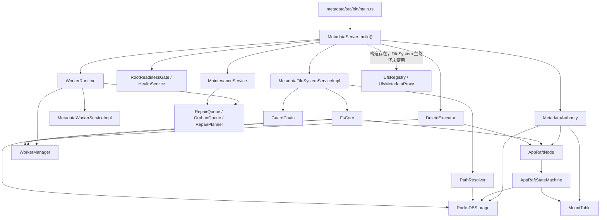

# Vecton Metadata 当前实现说明

本文只描述当前仓库 `metadata` crate 的真实实现状态。未闭环能力会明确标为“部分实现”“未实现”“历史残留”“可保留但暂缓”或“可疑候选”。不要从旧设计文档或模块名反推能力。

## 1. Metadata 当前定位

`metadata` 是 Vecton 的文件系统元数据权威面，当前负责：

- inode / dentry / attrs 权威模型。
- mount table、namespace owner group、mount_epoch、route_epoch。
- FileSystemService 的 metadata/control-plane RPC。
- Raft state machine 和 RocksDB 持久化。
- write handle、fencing token、inode lease、file_version。
- worker descriptor 持久态、heartbeat/block report soft state、delete intent。
- gRPC OK + `ResponseHeader.error` 的 recoverable error contract。

`metadata` 不做数据面 IO。client 到 worker 的直接数据路径不以本 crate 完成度作为判断核心；metadata 只维护或返回数据路径所需的控制面信息，例如 read plan、write target、block identity、worker route hint 和 refresh hint。

当前必须避免的误写：

- 不把 path 写成 persisted source of truth；path 只是 dentry/inode traversal 的输入适配。
- 不把 worker block locations 写成 block presence authority；它是 `WorkerManager` 内存 soft state。
- 不把 UFS proxy 写成 FileSystemService 主路径能力；runtime 构造存在，但 namespace read/write 没有调用它。
- 不把 repair/rebalance/delete 写成完整生产级自治系统；它们是已接入的后台框架和部分闭环。

## 2. 当前实现总览



当前状态汇总：

| 状态 | 范围 |
| --- | --- |
| 已实现 | 薄 `main.rs`、runtime composition、root readiness、FileSystemService 新 16 RPC、inode/dentry/attrs authority、mount_epoch/route_epoch/state watermark freshness、durable single `file_version`、write lifecycle 主链路、worker register 持久化、block report soft locations、delete intent Raft apply/status 更新。 |
| 部分实现 | maintenance/repair/delete framework、worker command heartbeat pull、full block report lease、GC/orphan/overrep intent creation、repair queue ack/retry、client refresh/replay 配合。 |
| 未实现 | recursive directory delete、Hflush/Hsync barrier、ACL/Ranger、完整 UFS-backed namespace、生产级 repair/move/evict/rebalance 策略、多 group msync、follower read 全路径、专用 mount refresh API、path->group route cache。 |
| 历史残留 | `report_presence`、`MemoryStateStore` 测试/placeholder、`CommandSender` push-mode no-op、StateStore 中部分 block/lease mutation API、若干 stale code comments/docs references。 |
| 可保留但暂缓 | RepairPlanner/RepairQueue/OrphanQueue、DeleteExecutor、MaintenanceService、UFS proxy、authz extension point。 |

## 3. 启动链路

`metadata/src/bin/main.rs` 仍是薄入口，只执行：

1. `load_config()`
2. `init_observability(config.as_ref())`
3. `MetadataServer::build(config).await`
4. `server.serve().await`

`MetadataServer::build()` 当前按依赖顺序构造长期对象：

| 阶段 | 当前事实 | 状态 |
| --- | --- | --- |
| `build_authority()` | 打开 RocksDB，加载 `MountTable`，构造 `AppRaftStateMachine` / `AppRaftNode`，执行 root mount bootstrap，构造 `RaftStateStore`、`UfsRegistry`、`UfsMetadataProxy`。 | 已实现 |
| `build_worker_runtime()` | 创建 required `WorkerRuntime`、`WorkerManager`、repair/orphan queue、planner，并构造 `MetadataWorkerServiceImpl`。 | 已实现 |
| `build_readiness()` | 启动 root readiness watcher，HealthService 初始 not-serving，root ready 后标记 serving。 | 已实现 |
| `build_filesystem_service()` | 构造 write session manager、inode lease manager、permission checker、`PathResolver`、`FsCore`、`GuardChain`、`MsyncHandler`。 | 已实现 |
| `build_maintenance()` | 启动 lease runtime、`MaintenanceService`、`DeleteExecutor`。 | 已接入，部分闭环 |
| `build_worker_background()` | 给 worker service 注入 `DeleteExecutor`，启动 worker background tasks。 | 已接入 |
| `serve()` | 注册 FileSystemService、MetadataWorkerService、HealthService，并持有 `RuntimeHandles`。 | 已实现 |

`RuntimeHandles` 当前持有 `WorkerBackgroundHandle`、`MaintenanceHandle`、`DeleteExecutorHandle`、`ReadinessHandle`。这些 handle 保留后台 task 的 `JoinHandle`，但没有 cancellation token、逐 task stop 或 join 流程，所以不能描述为完整 graceful shutdown。

optional vs required：

- worker runtime 当前是 required subsystem；不存在 disabled-worker metadata runtime。
- UFS registry/proxy 是构造存在但主路径未使用的 subsystem。
- maintenance/delete/worker background 启动存在，但其能力成熟度不能等同于完整自治后台系统。

## 4. FileSystem 主链路

当前对外 filesystem RPC 入口是 `MetadataFileSystemServiceImpl`，完整实现在 `metadata/src/service/path_service.rs`。该文件仍保持完整 FileSystemService API 视图，没有拆出第二个 external metadata service。

主链路是：

```text
FileSystemService RPC
-> RequestContext/header extraction
-> GuardChain
-> PathResolver
-> FsCore
-> AppRaftNode propose / RocksDB read
-> AppRaftStateMachine apply
-> ResponseHeader + payload
```

职责边界：

- `path_service.rs` 是 adapter/orchestration：tonic request/response、header、guard、path resolve、permission target、proto/domain 转换、FsCore 调用、ResponseHeader 构造。
- `FsCore` 承载 domain semantics：mount/route/state freshness、write session、lease、fencing、read plan 校验、mutation orchestration。
- `PathResolver` 只做 path -> mount context -> dentry/inode traversal，不写 path index。
- `GuardChain` 只做 readiness、leadership、data IO policy、permission extension point；不检查 mount_epoch、route_epoch、state_id、write handle、lease、fencing 或 worker_epoch。

`path_service.rs` 仍偏大，但当前保留“完整 FileSystemService API 文件”的边界。它不是第二个 metadata authority。

## 5. Authority model

当前 authority model 是 inode-centric：

- inode 是 filesystem object identity。
- dentry 是 `(parent_inode_id, name) -> child_inode_id` 的持久映射。
- attrs 是 inode 上的属性事实。
- path 只用于 request adapter 和 traversal。
- mount 通过 `MountTable` 做 longest-prefix match，mount root 绑定 root inode。

namespace / mount / route 当前事实：

- `MountTable::load_from_storage()` 启动时从 RocksDB mounts CF 载入；Raft apply `CreateMount` / `DeleteMount` 后同步更新内存表。
- `namespace_owner_group_id` 是 mount 内 filesystem mutation owner group。
- `mount_epoch` 使用 `MountEntry::config_version`。
- `route_epoch` 存在 RocksDB meta CF；`CreateMount` / `DeleteMount` 推进；`AddShardGroup` 当前不推进 filesystem-facing `route_epoch`。
- rename/delete/create/mkdir 等 namespace mutation 通过 `Command` propose 到 Raft authority。
- same-mount rename 是当前实现边界；cross-mount rename 返回 structured EXDEV/CrossMountRename。

root mount bootstrap：

- 已有 `/` mount 时必须满足 `ROOT_INODE_ID`、`MountKind::Internal`、无 `ufs_uri`、`DataIoPolicy::Forbid`。
- 缺失时 leader 通过 `Command::CreateMount` 创建；非 leader 直接返回，readiness watcher 等待。
- root mount 不能删除。

## 6. FileSystem API 当前状态

`FileSystemServiceProto` 当前 public RPC 已收敛为新 16 个：

| 类别 | RPC | 当前状态 |
| --- | --- | --- |
| metadata read | `GetStatus`, `ListStatus` | 已实现；recursive listing 返回 structured `NotSupported`。 |
| namespace mutation | `CreateDirectory`, `Delete`, `Rename` | 已实现主链路；`Delete(recursive=true)` 对目录未实现；rename overwrite cleanup 已实现。 |
| read plan | `OpenFile`, `GetBlockLocations` | 已实现 read-plan API；返回 external `FileBlockLocation`，worker locations 是 soft route hints。 |
| write lifecycle | `CreateFile`, `AppendFile`, `AddBlock`, `CommitFile`, `AbortFileWrite`, `RenewLease` | 已实现主链路；`WriteSession` 是内部 runtime concept，不是 public RPC 命名。 |
| reserved barrier | `Hflush`, `Hsync` | public RPC 保留，但当前返回 structured `NotSupported`，不是 visibility/durability barrier。 |
| freshness sync | `Msync` | 已实现 production single-group local authoritative state 返回；multi-group msync 未实现。 |

public surface 当前没有旧 FUSE/POSIX 残留 RPC：

- 没有 public `OpenPath`、`ReleasePath`、`TruncatePath`。
- 没有 public `OpenWriteByPath`、`CloseWriteSession`、`RenewWriteSessionLease`。
- 没有 public `Unlink` / `Rmdir`；对外删除统一是 `Delete(DeleteRequestProto)`。
- `Unlink` / `Rmdir` 仍是 FsCore/Raft 内部 domain mutation 名称。
- `SetXattr` / `RemoveXattr` 只在 internal `Command` / state machine 层存在，当前没有 public FileSystem RPC 或主链路 caller。

## 7. Write lifecycle 当前状态

当前 write lifecycle：

1. `CreateFile`：对新文件先通过 internal `Command::Create` 分配 inode 和 durable `current_data_handle_id`，写入 `data_handle_owner`，然后打开内部 write session。
2. `AppendFile`：在现有 file inode 上打开 append write session。
3. `AddBlock`：校验 write handle、lease、open_epoch、fencing token、route/mount freshness，从 `WorkerManager` 选择 write target，返回 block target。
4. `CommitFile`：校验 committed block 与 request `data_handle_id` 一致，进入 internal close-write apply。
5. `AbortFileWrite`：关闭内部 session/lease，不发布新 committed layout。
6. `RenewLease`：更新内部 inode lease runtime，不写 Raft。

commit/version 当前事实：

- `FileCommitMode` 只有 `Replace` 和 `Append`。
- `CreateFile(CREATE_NEW/OVERWRITE)` 使用 Replace 语义；`AppendFile` 使用 Append 语义。
- `file_version` 是 durable single file version，持久化在 file inode 中，只由 Raft apply 推进。
- 当前不引入 `layout_version`。
- worker block report、worker location、repair placement、route_epoch、mount_epoch、worker_epoch、rename、chmod/chown/mtime-only metadata change 不推进 `file_version`。
- CommitFile 背后的 close-write apply 会同 batch 写 inode extents/size/mtime/file_version/lease_epoch、stable `FileLayout`、block refcount increment/decrement、zero-ref delete intent 和 `AppliedResult`。

限制：

- `Hflush` / `Hsync` 当前只是 reserved public RPC，返回 structured `NotSupported`。
- Truncate grow 未实现；Truncate shrink 在 state machine 层存在并推进 file_version，但当前没有 public FileSystem RPC。
- `WriteSession` 是 runtime-only 内部对象，不是持久 metadata identity；持久 identity 是 inode/data_handle/file_version，session identity 是 write handle/fencing/open_epoch。

## 8. Read plan / freshness 当前状态

`OpenFile` / `GetBlockLocations` 当前返回：

- `inode_id`
- current `data_handle_id`
- `file_size`
- `file_version`
- external `FileBlockLocationProto` 列表
- `ResponseHeader` 中的 group/mount/route/state hints

read-plan 校验：

- `GetBlockLocations(data_handle_id)` 先通过 `data_handle_owner` 找 owner inode，再校验 request handle 等于 inode 当前 `current_data_handle_id`。
- 如果 request data_handle 已过期，返回 structured `StaleState` / NEED_REFRESH。
- extents 中的 block data_handle 必须匹配 inode 当前 data_handle。
- range 使用 checked arithmetic；`offset + len` 溢出返回 structured invalid argument，`len = 0` 返回空 locations。

worker location 边界：

- `FileBlockLocation` 是 external read plan，不暴露 internal extents schema。
- 当 `WorkerManager` 有 live block locations 时，会填充 worker id、endpoint、transport kind、worker_epoch。
- worker locations 来自 heartbeat/block report soft state，不是 Raft authority，不是 placement truth，也不是完整 load-aware/fault-domain/nearest-worker scheduler。

freshness 当前事实：

- `mount_epoch` 校验 request header 和 mount entry `config_version`。
- `route_epoch` 校验 request/header 和 authoritative RocksDB route epoch。
- `state_id` 只通过 repeated `GroupStateWatermark { group_id, state_id }` 表达。
- `state_id` 表示 state-machine applied `RaftLogId`，不是 committed index、route_epoch、mount_epoch、worker_epoch 或旧 `applied_seq`。
- leader success 在已知 group 且有 last applied state 时返回 `ResponseHeader.state`。
- follower success 必须返回空 `ResponseHeader.state`，不推进 client state cache。
- `Msync` 当前是 production single-group；返回本地 raft group authoritative state。multi-group msync 未实现。
- `MOVED` 在 FileSystemService/client refresh 中仍 de-scope，不应写成已完成 shard-move 语义。

## 9. Raft / RocksDB 当前状态

Raft apply 当前统一做 dedup：

- `DedupKey = client_id + call_id`，只表示一个逻辑 mutation request identity。
- `CommandFingerprint` 表示 command type + semantic payload，用于防止同一 DedupKey 被不同 payload 复用。
- `AppliedResult` 是 applied mutation replay record，不是通用 RPC response cache。
- read-only RPC 不写 `AppliedResult`。

已和 `AppliedResult` 同 batch 的 mutation inventory：

| 分类 | Command / path |
| --- | --- |
| DONE | `Create`, `Mkdir`, `Rmdir`, empty-file `Unlink`, extent-bearing file `Unlink`, `Rename` including overwrite target cleanup, `CloseWrite`, `Truncate` shrink, `CreateDeleteIntents`, `AllocateDeleteIntents`, `UpdateDeleteIntentStatus`, `CreateMount`, `DeleteMount`, `AddShardGroup`, `RegisterWorker`, `AcquireLease`, `ReleaseLease`, block allocate/state/commit paths。 |
| STRUCTURED_ERROR_REPLAY | deterministic FS business errors for create/mkdir/unlink/rmdir/rename/close-write/truncate/xattr are persisted as `AppliedResult` when they happen inside apply preparation. |
| INTERNAL_NO_PUBLIC_API | `SetXattr` / `RemoveXattr` apply and dedup exist, but no public FileSystem RPC/caller was found in the scan. |
| DIRECT_ROCKSDB_TODO | `MaintenanceService::increment_ref_count()` / `decrement_ref_count()` still directly write block refcount compatibility state outside a Raft command path; no current caller found in metadata scan. |

已清理：

- `UpdateCommittedLength` legacy command path 已删除。Committed length mutation 语义不再作为独立 command 存在；当前 committed file state 通过 `CommitFile` / `CloseWrite` apply 和 durable `file_version` 维护。

snapshot / state store：

- `state_machine_store.rs` snapshot V1 header carries route epoch; snapshot payload covers replicated state CFs.
- No runtime/storage/snapshot/header/client `applied_seq` path should be reintroduced.
- `RaftStateStore` uses `AppRaftNode::read(false, ...)`, current path is leader-read, not follower read.
- `MemoryStateStore` is placeholder/test support, not production authority.

## 10. Worker metadata 链路

`MetadataWorkerServiceImpl` 当前处理 worker register、heartbeat、block report、task ack、deprecated report_presence。

register：

- endpoint + labels 生成 stable identity。
- `Command::RegisterWorker` 通过 Raft apply 持久化 identity mapping、worker descriptor、`next_worker_id` allocator 和 `AppliedResult`。
- propose 成功后才调用 `WorkerManager::register_worker()` 更新 runtime descriptor。
- `suggested_worker_id` 不再 authoritative。

heartbeat：

- 所有节点更新 `WorkerManager` runtime soft state，不走 Raft。
- leader 发现 descriptor drift 时返回 non-OK gRPC `failed_precondition` 要求 re-register。
- leader 分配 full block report lease、处理 task ack、从 DeleteExecutor/RepairQueue 拉取 worker command。
- follower 不分配 full report lease，不下发 repair/delete command。

block report：

- full report 在需要 full sync 时必须带 lease token。
- full report 替换该 worker block set；incremental report 在 full sync 基础上应用 delta。
- block locations 是 memory-only soft state。
- leader 对新增 block 做 orphan 检测和 replication planning。

`report_presence`：

- RPC 仍存在。
- 当前是 deprecated/no-op，只返回 ack。
- README 和外部文档不能把它描述成强一致 presence 来源；当前主来源是 `block_report`。

## 11. Maintenance / Repair / Delete 当前状态

`MaintenanceService::start()` 当前启动 7 个后台 task：

- GC task。
- GC refcount reload self-healing。
- lease cleanup。
- orphan cleanup。
- rebalance task。
- repair timeout requeue。
- over-replication cleanup。

已接入：

- `MaintenanceService` 在 runtime 中启动。
- `DeleteExecutor` 在 runtime 中启动并接入 worker heartbeat command/ack。
- `RepairQueue` 支持 pending/in-flight/done/failed、dedup、worker inflight limit、retry/backoff、timeout requeue。
- `RepairPlanner` 可 plan Replicate、MoveCopy、EvictReplica。
- GC/orphan/overrep 可通过 `Command::AllocateDeleteIntents` 创建 authoritative delete intent。
- `DeleteExecutor` 可读取 pending intents，执行 destructive gate，生成 `DeleteBlocksCommandProto`，并通过 `Command::UpdateDeleteIntentStatus` 持久化 Completed/Failed。

部分闭环或保守说明：

- physical deletion 仍依赖 worker 执行、worker ack、后续 block report reconcile；metadata apply 本身不做数据面删除。
- repair/move/evict 是否端到端成功取决于 worker/data-plane 配合，metadata 侧不能单独证明完整自治 repair。
- replication factor 多处仍硬编码为 `3u8`。
- rebalance 是简单 load heuristic，不是生产级调度。
- fault-domain / hotness / placement policy 未闭环。
- full-report mount_epoch 当前用 `mount_table.version()`，代码中仍标有 TODO-2，不应写成完整 route/mount gating。

## 12. UFS / External Mount 当前状态

已实现：

- `MountKind::External` 和 `ufs_uri` 可在 mount metadata 中表达。
- `MountTable::resolve_path()` 可把统一路径映射为 UFS URI + relative path。
- `UfsMetadataProxy` 实现了 stat/list/rename/delete/exists 等代理方法。
- runtime 构造 `UfsRegistry` 和 `UfsMetadataProxy`，并保存在 `MetadataAuthority` 私有字段。

未闭环：

- `MetadataFileSystemServiceImpl` 没有注入或调用 `UfsMetadataProxy`。
- 当前 FileSystem namespace read/write 主路径仍走 inode/dentry/attrs/Raft/RocksDB。
- external mount 只是 metadata 表达和 data IO policy 的部分存在，不是完整 UFS-backed namespace。
- UFS proxy 内部 URI -> UFS id 解析仍是简化 heuristic。

## 13. Error model 与 refresh 闭环

wire contract 当前仍成立：

- recoverable business/protocol/consistency failure 使用 gRPC OK + `ResponseHeader.error`。
- transport/auth/framework failure 使用 non-OK gRPC status。

当前映射：

- `LeaderChanged` / not leader、`MountEpochMismatch`、`RoutingStale`、`StaleState`、`LeaseFenced`、`ServiceUnavailable` 等会映射到 machine-usable canonical/header error。
- NEED_REFRESH 用于 route/mount/state/leader 等可刷新错误。
- RETRYABLE 用于服务暂不可用等可重试但不一定刷新 replay 的错误。
- FATAL 用于权限、参数、unsupported、terminal FS errno 等。
- worker RPC 的输入错误、descriptor drift 等可返回 non-OK gRPC status。

client 配合不是本轮 metadata 完成度核心，但当前事实是：

- client action machine 已有 header error 解析和 refresh/replay 分支。
- `resolve_path_to_group()` 仍返回 `None`；path->group route cache 未闭环。
- mount refresh 没有专用 API，当前 fallback 到 route/status refresh。
- MOVED / ShardMoved 仍 de-scope。

## 14. 当前已完成整理

当前已完成的整理只按代码事实列出：

- `main.rs` 已保持薄入口，runtime composition 集中在 `runtime.rs`。
- `MetadataServer::build()` 统一构造 authority、required worker runtime、readiness、filesystem service、maintenance、worker background、services 和 runtime handles。
- FileSystemService external API 收敛为 16 RPC。
- `path_service.rs` 保持完整 FileSystemService adapter 文件；没有第二套 public metadata authority。
- `FsCore` 已拆成 read/mutation/write_session/freshness 子模块。
- guard 与 domain freshness 分离。
- public delete API 统一为 `Delete`；`Unlink` / `Rmdir` 是内部 domain mutation。
- durable single `file_version` 已完成；不引入 `layout_version`。
- rename overwrite regular-file target cleanup 已进入 atomic apply path。
- worker descriptor 持久态与 heartbeat/block location soft state 已分离。
- block report 是当前 block presence 主来源；`report_presence` 是 deprecated/no-op。
- `UpdateDeleteIntentStatus` 已通过 Raft command 持久化，不再应描述为直接 RocksDB status update。

## 15. 文档/历史残留清理状态

本节记录当前 checkout 中已完成的 focused doc/comment cleanup，不表示新增功能。

- `metadata/src/lib.rs` crate docs 已改为当前 `MetadataServer` runtime、`MetadataFileSystemServiceImpl`、`MetadataWorkerServiceImpl` 和 FileSystemService external API 事实；不再引用当前 checkout 缺失的 metadata docs path，也不再描述旧 client service 名称。
- `metadata/src/service/mod.rs` module docs 已改为当前 FileSystemService adapter / GuardChain / FsCore / msync / auth extension point 事实。
- 当前 checkout 未包含 `docs/architecture` 目录；README 不把该目录写成当前可读实现文档。
- `report_presence` 已明确为 deprecated/no-op；当前 block presence authoritative input 是 `block_report`。
- `metadata/src/worker/command_sender.rs` 已明确为 heartbeat-pull 模型下的 no-op legacy hook，不是 push queue 或 push transport。
- `Command::UpdateCommittedLength` legacy command path 已删除；scan 未发现当前 public caller。
- `MemoryStateStore` 已明确为 tests/helpers 使用，production runtime 使用 `RaftStateStore`。
- `StateStore` 已明确为比当前生产 freshness read 更宽的旧抽象接口，保留为后续收窄候选。
- `state::DeleteIntent` 注释已修正：当前 `DeleteExecutor` status transition 使用 `Command::UpdateDeleteIntentStatus`，不能把 direct RocksDB status write 写成当前主链路。
- `UfsMetadataProxy` 注释已明确 runtime 构造存在，但 FileSystemService namespace read/write 主路径未调用。
- `maintenance/mod.rs` re-export 注释已去掉 backward-compatibility wording；public surface 是否继续收窄仍作为后续候选。

## 16. 当前风险、历史包袱、TODO

高优先级 correctness / capability gaps：

- Recursive directory delete 未实现；`Delete(recursive=true)` 对目录返回 `NotSupported`，不遍历、不局部删除、不创建 delete intent。
- `Hflush` / `Hsync` 不是 barrier，只是 structured `NotSupported`。
- UFS proxy 未接入 FileSystemService 主路径。
- ACL/Ranger 配置存在但 fail fast，不是 MVP/stub。
- repair/delete/rebalance 不能描述为完整生产级自治系统。
- multi-group msync、follower read 全路径、MOVED/shard migration、专用 mount refresh API 未实现。

历史残留：

- `SetXattr` / `RemoveXattr` apply 存在，当前没有 public FileSystem RPC/caller。
- `MemoryStateStore` 和 `StateStore` 的部分 block/lease mutation API 已主要服务测试或旧抽象。
- `CommandSender` 是 push-mode no-op；实际 worker command 通过 heartbeat pull。
- `CommandSender`、`MemoryStateStore`、`StateStore` 仍保留为代码表面；本轮只修正文档/注释，不删除生产代码。
- `metadata/src/maintenance/mod.rs` 仍是 maintenance public re-export 聚合入口；本轮只清理 stale wording，不收窄 export surface。

验证状态：

- 本轮 cleanup 已确认 `cargo fmt --all --check`、`cargo check -p metadata --all-targets`、`cargo test -p metadata --all-targets`、`cargo clippy -p metadata --all-targets -- -D warnings` 当前通过。
- `cargo fmt --all --check` 仍输出 stable rustfmt 对 unstable import 配置的 warning，但命令退出码为 0。
- `git diff --check` 结果以本轮交付说明为准。

## 17. 多余 / 不必要设计候选

本节只是候选清单，不在本轮删除。

| 文件/模块 | 当前引用情况 | 为什么可疑 | 建议 | 风险 |
| --- | --- | --- | --- | --- |
| `metadata/src/ufs_proxy.rs` + `MetadataAuthority::_ufs_*` | runtime 构造并持有；FileSystemService 主路径未调用 | external mount 容易被误写成完整 UFS-backed namespace | 可保留但降级为“构造存在/暂缓接入”；若短期不做 UFS，可后续删除候选 | 删除会影响 mount external 表达测试和未来 UFS 接入入口 |
| `metadata/src/state/memory.rs` / `MemoryStateStore` | regression/FsCore tests 使用；lib.rs re-export | 生产 runtime 使用 `RaftStateStore`，但 test helper 仍在 public state surface | 保留为 test helper，后续考虑移入测试辅助并取消 public re-export | 直接删除会破坏现有 tests |
| `metadata/src/state/mod.rs::StateStore` block/lease mutation methods | production freshness 主要用 `get_route_epoch()`；部分 mutation method 无 metadata caller | trait 比当前 FsCore 需要更宽，保留旧 data-control/block lease 抽象痕迹 | 后续再审，收窄为 freshness/read trait 或拆分 | 可能影响 `RaftStateStore` tests/旧 data-control 入口 |
| `Command::SetXattr` / `RemoveXattr` | state machine apply/tests 存在；FileSystem public RPC/caller 未发现 | internal capability 无 public surface，容易误判成 xattr 已实现 | 后续再审：保留内部能力或删除候选 | 可能影响未来 xattr API；删除需同步 tests |
| `metadata/src/worker/command_sender.rs` | `MetadataWorkerServiceImpl` 持有 `_command_sender`；实际 send 是 heartbeat pull no-op | push-mode 抽象残留，当前只保留 no-op hook | 降级/合并/删除候选 | 如果未来恢复 push command，需要替代入口 |
| `WorkerManager::try_start_full_sync`、`max_concurrent_full_syncs`、`concurrent_full_syncs` | deprecated path；tests 仍覆盖 | full report 已转为 lease manager；旧 counter 语义残留 | 删除候选，先改 tests | 直接删会破坏 tests 和可能的兼容调用 |
| `MaintenanceService::increment_ref_count()` / `decrement_ref_count()` | scan 未发现 metadata caller；直接写 RocksDB block refcount | 绕开 Raft command/apply atomicity；README 不能把它算入闭环 | 删除候选或改为只读/测试辅助；如需保留必须重新路由 | 若外部 crate 调用 public method，删除会 breaking |
| `metadata/src/maintenance/mod.rs` re-export surface | 对外 re-export 多个 maintenance 类型 | 聚合层可能扩大 public surface | 保留但后续收窄 public exports | 过早收窄会影响 tests/imports |
| `docs/architecture/*` | 本轮扫描未发现 `docs/architecture` 目录 | 用户指定的背景目录当前不存在 | 无需处理；后续若新增再审 | 无 |

## 18. Metadata 瘦身建议

必须保留的主链路：

- `MetadataFileSystemServiceImpl`
- `GuardChain`
- `PathResolver`
- `FsCore`
- `MountTable`
- `AppRaftNode` / `AppRaftStateMachine`
- `RocksDBStorage`
- `RaftStateStore`
- write session manager / inode lease manager / fencing token
- `ResponseHeader.error` contract

可以保留但默认保守的框架：

- `MaintenanceService`
- `RepairQueue`
- `OrphanQueue`
- `RepairPlanner`
- `DeleteExecutor`
- UFS proxy
- authz extension point

优先瘦身方向：

- 先收窄或删除没有主链路 caller 的 legacy command/API。
- 把 no-op / placeholder 明确降级，不写成能力。
- 对 direct RocksDB compatibility write 保持审计压力，不把它混入 authoritative Raft apply closure。
- 对 maintenance/repair/rebalance 只保留当前能证明的闭环，避免扩展策略复杂度。
- 对 UFS 和 ACL/Ranger 保持 fail-fast/未接入描述，避免隐式 allow-all 或半成品代理。

## 19. 快速阅读路径

建议按以下顺序读当前真实实现：

1. `metadata/src/bin/main.rs`
2. `metadata/src/runtime.rs`
3. `metadata/src/bootstrap.rs`
4. `metadata/src/readiness.rs`
5. `metadata/src/service/path_service.rs`
6. `metadata/src/service/guard.rs`
7. `metadata/src/service/auth.rs`
8. `metadata/src/path_resolver.rs`
9. `metadata/src/service/fs_core/mod.rs`
10. `metadata/src/service/fs_core/freshness.rs`
11. `metadata/src/service/fs_core/read.rs`
12. `metadata/src/service/fs_core/mutation.rs`
13. `metadata/src/service/fs_core/write_session.rs`
14. `metadata/src/raft/command.rs`
15. `metadata/src/raft/state_machine.rs`
16. `metadata/src/raft/storage.rs`
17. `metadata/src/raft/state_machine_store.rs`
18. `metadata/src/state/raft_store.rs`
19. `metadata/src/mount/mod.rs`
20. `metadata/src/worker/service.rs`
21. `metadata/src/worker/manager.rs`
22. `metadata/src/worker/delete_executor.rs`
23. `metadata/src/worker/repair/`
24. `metadata/src/maintenance/service.rs`
25. `metadata/src/maintenance/gc.rs`
26. `metadata/src/maintenance/orphan.rs`
27. `metadata/src/maintenance/overrep.rs`
28. `metadata/src/ufs_proxy.rs`
29. `metadata/tests/path_service_regression_tests.rs`
30. `metadata/tests/service_error_contract_tests.rs`

不要从旧 docs 或模块名反推能力；以这些代码路径当前行为为准。
