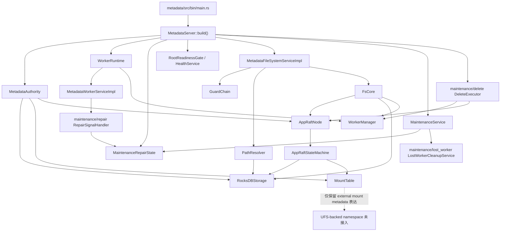

# Vecton Metadata 当前实现说明

本文只描述当前仓库 `metadata` crate 的真实实现状态。未闭环能力会明确标为“部分实现”“未实现”“历史残留”“可保留但暂缓”或“可疑候选”。不要从旧设计文档或模块名反推能力。

P0 架构边界和后续重组计划见 [`ARCHITECTURE_ZH.md`](ARCHITECTURE_ZH.md)。

## 1. Metadata 当前定位

`metadata` 是 Vecton 的文件系统元数据权威面，当前负责：

- inode / dentry / attrs 权威模型。
- mount table、namespace owner group、mount_epoch、route_epoch。
- FileSystemService 的 metadata/control-plane RPC。
- Raft state machine 和 RocksDB 持久化。
- write handle、fencing token、inode lease、file_version。
- worker descriptor 持久态、heartbeat/block report soft state、delete intent。
- gRPC OK + `ResponseHeader.error` 的 recoverable error contract。

`metadata` 不做数据面 IO。client 到 worker 的直接数据路径不以本 crate 完成度作为判断核心；metadata 只维护或返回数据路径所需的控制面信息，例如 read plan、write target、block identity、worker route hint 和 refresh hint。

当前必须避免的误写：

- 不把 path 写成 persisted source of truth；path 只是 dentry/inode traversal 的输入适配。
- 不把 worker block locations 写成 block presence authority；它是 `WorkerManager` 内存 soft state。
- 不把 external mount 写成 UFS-backed namespace；当前没有 UFS metadata proxy 代码，也没有 FileSystemService 主路径接入。
- 不把 repair/rebalance/delete 写成完整生产级自治系统；它们是已接入的后台框架和部分闭环。

## 2. 当前实现总览



当前状态汇总：

| 状态 | 范围 |
| --- | --- |
| 已实现 | 薄 `main.rs`、runtime composition、root readiness、FileSystemService 新 16 RPC、inode/dentry/attrs authority、mount_epoch/route_epoch/state watermark freshness、durable single `file_version`、write lifecycle 主链路、worker register 持久化、block report soft locations、delete intent Raft apply/status 更新。 |
| 部分实现 | maintenance/repair/delete framework、worker command heartbeat pull、full block report lease、GC/orphan/overrep intent creation、repair queue ack/retry、client refresh/replay 配合。 |
| 未实现 | recursive directory delete、ACL/Ranger、完整 UFS-backed namespace、生产级 repair/move/evict/rebalance 策略、多 group msync、follower read 全路径、专用 mount refresh API、path->group route cache。 |
| 历史残留 | `MemoryStateStore` route-epoch 测试 helper。 |
| 可保留但暂缓 | maintenance/repair 的 RepairPlanner/RepairQueue/OrphanQueue、maintenance/delete 的 DeleteExecutor、MaintenanceService、authz extension point。 |

## 3. 启动链路

`metadata/src/bin/main.rs` 是薄命令入口：

1. 解析 metadata 命令，当前支持 `metadata format --config <path>` 和 `metadata start --config <path>`。
2. 加载 metadata config。
3. `format` 调用 metadata format lifecycle，创建 metadata marker、single-node Raft membership 和 root namespace，然后退出；该离线命令不初始化 Prometheus/metrics endpoint。
4. `start` 初始化 common observability/metrics recorder/exporter，调用 `MetadataServer::build(config).await` 构造长期 runtime，然后 `server.serve().await`。

`MetadataServer::build()` 当前按依赖顺序构造长期对象：

| 阶段 | 当前事实 | 状态 |
| --- | --- | --- |
| `build_authority()` | 通过 existing-only RocksDB open 加载已格式化状态，加载 `MountTable`，构造 `AppRaftStateMachine` / `AppRaftNode`，构造 `RaftStateStore`；start 路径只加载和校验已有 root 状态。 | 已实现 |
| `build_maintenance_repair_state()` | 创建 maintenance-owned `RepairQueue`、`OrphanQueue`、`RepairPlanner` 和 shared `InflightRegistry`。 | 已实现 |
| `build_worker_runtime()` | 创建 required `WorkerRuntime`、`WorkerManager`，构造只持有 repair signal handler 的 `MetadataWorkerServiceImpl`。 | 已实现 |
| `build_readiness()` | 启动 root readiness watcher，HealthService 初始 not-serving，root ready 后标记 serving。 | 已实现 |
| `build_filesystem_service()` | 构造 write session manager、inode lease manager、permission checker、`PathResolver`、`FsCore`、`GuardChain`、`MsyncHandler`。 | 已实现 |
| `build_maintenance()` | 启动 `MaintenanceService`、`DeleteExecutor`；`MaintenanceService` 内部启动 lost-worker cleanup；standalone `lease_runtime` 半接入路径已删除。 | 已接入，部分闭环 |
| `build_worker_background()` | 给 worker service 注入 `WorkerCommandRouter`，router 聚合 maintenance/delete 与 maintenance/repair command source，并启动 worker-local background tasks。 | 已接入 |
| `serve()` | 注册 FileSystemService、MetadataWorkerService、HealthService，并持有 `RuntimeHandles`。 | 已实现 |

`RuntimeHandles` 当前持有 `WorkerBackgroundHandle`、`MaintenanceHandle`、`DeleteExecutorHandle`、`ReadinessHandle`。这些 handle 保留后台 task 的 `JoinHandle`，但没有 cancellation token、逐 task stop 或 join 流程，所以不能描述为完整 graceful shutdown。

optional vs required：

- worker runtime 当前是 required subsystem；不存在 disabled-worker metadata runtime。
- UFS metadata proxy 已删除；external mount 仍只是 metadata 表达，不是 FileSystemService 主路径能力。
- maintenance/delete/worker background 启动存在，但其能力成熟度不能等同于完整自治后台系统。

## 4. FileSystem 主链路

当前对外 filesystem RPC 入口是 `MetadataFileSystemServiceImpl`，完整实现在 `metadata/src/service/path_service.rs`。该文件仍保持完整 FileSystemService API 视图，没有拆出第二个 external metadata service。

主链路是：

```text
FileSystemService RPC
-> RequestContext/header extraction
-> GuardChain
-> PathResolver
-> FsCore
-> AppRaftNode propose / RocksDB read
-> AppRaftStateMachine apply
-> ResponseHeader + payload
```

职责边界：

- `path_service.rs` 是 adapter/orchestration：tonic request/response、header、guard、path resolve、permission target、proto/domain 转换、FsCore 调用、ResponseHeader 构造。
- `FsCore` 承载 domain semantics：mount/route/state freshness、write session、lease、fencing、read plan 校验、mutation orchestration。
- `PathResolver` 只做 path -> mount context -> dentry/inode traversal，不写 path index。
- `GuardChain` 只做 readiness、leadership、data IO policy、permission extension point；不检查 mount_epoch、route_epoch、state_id、write handle、lease、fencing、WorkerRunId 或 block_stamp。

`path_service.rs` 仍偏大，但当前保留“完整 FileSystemService API 文件”的边界。它不是第二个 metadata authority。

## 5. Authority model

当前 authority model 是 inode-centric：

- inode 是 filesystem object identity。
- dentry 是 `(parent_inode_id, name) -> child_inode_id` 的持久映射。
- attrs 是 inode 上的属性事实。
- path 只用于 request adapter 和 traversal。
- mount 通过 `MountTable` 做 longest-prefix match，mount root 绑定 root inode。

namespace / mount / route 当前事实：

- `MountTable::load_from_storage()` 启动时从 RocksDB mounts CF 载入；Raft apply `CreateMount` / `DeleteMount` 后同步更新内存表。
- `namespace_owner_group_name` 是 mount 内 filesystem mutation owner group。
- `MountEntry.mount_version` / `MountEntryProto.mount_version` 是 per-mount entry version，对外作为 `mount_epoch` freshness token 使用。
- `MountTable::version()` 是 table-level version counter，不是 per-entry `MountEntry.mount_version` getter。
- `route_epoch` 存在 RocksDB meta CF；`CreateMount` / `DeleteMount` 推进；`AddShardGroup` 当前不推进 filesystem-facing `route_epoch`。
- rename/delete/create/mkdir 等 namespace mutation 通过 `Command` propose 到 Raft authority。
- same-mount rename 是当前实现边界；cross-mount rename 返回 structured EXDEV/CrossMountRename。

root mount 格式化与 readiness：

- 已有 `/` mount 时必须满足 `ROOT_INODE_ID`、`MountKind::Internal`、无 `ufs_uri`、`DataIoPolicy::Forbid`。
- `metadata format` 缺失 root mount 时通过 `Command::CreateMount` 创建。
- `metadata start` 不创建 root mount；缺失时 start preparation/readiness 路径返回 not-ready/error。
- root mount 不能删除。

## 6. FileSystem API 当前状态

`FileSystemServiceProto` 当前 public RPC 已收敛为新 16 个：

| 类别 | RPC | 当前状态 |
| --- | --- | --- |
| metadata read | `GetStatus`, `ListStatus` | 已实现；recursive listing 返回 structured `NotSupported`。 |
| namespace mutation | `CreateDirectory`, `Delete`, `Rename` | 已实现主链路；`Delete(recursive=true)` 对目录未实现；rename overwrite cleanup 已实现。 |
| read plan | `OpenFile`, `GetBlockLocations` | 已实现 read-plan API；`OpenFile` 返回读快照身份和版本，`GetBlockLocations` 返回 external `FileBlockLocation`，worker locations 是 soft route hints。 |
| write lifecycle | `CreateFile`, `AppendFile`, `AddBlock`, `CommitFile`, `AbortFileWrite`, `RenewLease` | 已实现主链路；`WriteSession` 是内部 runtime concept，不是 public RPC 命名。 |
| write barrier | `SyncWrite` | 已实现 visibility/durability barrier；成功时发布 `target_size` 前缀并保持 write session 打开。 |
| freshness sync | `Msync` | 已实现 production single-group local authoritative state 返回；multi-group msync 未实现。 |

public surface 当前没有旧 FUSE/POSIX 残留 RPC：

- 没有 public `OpenPath`、`ReleasePath`、`TruncatePath`。
- 没有 public `OpenWriteByPath`、`CloseWriteSession`、`RenewWriteSessionLease`。
- 没有 public file-delete / empty-directory-delete RPC；对外删除统一是 `Delete(DeleteRequestProto)`。
- 没有 public xattr API；历史 internal xattr command/apply path 已删除。
- `Unlink` / `DeleteEmptyDir` 仍是 FsCore/Raft 内部 domain mutation 名称。

## 7. Write lifecycle 当前状态

当前 write lifecycle：

1. `CreateFile`：对新文件先通过 internal `Command::Create` 分配 inode 和 durable `current_data_handle_id`，写入 `data_handle_owner`，然后打开内部 write session。
2. `AppendFile`：在现有 file inode 上打开 append write session。
3. `AddBlock`：校验 write handle、lease、open_epoch、fencing token、route/mount freshness，从 `WorkerManager` 选择 write target，返回 block target。
4. `CommitFile`：校验 committed block 与 request `data_handle_id` 一致，进入 internal close-write apply。
5. `AbortFileWrite`：关闭内部 session/lease，不发布新 committed layout。
6. `RenewLease`：更新内部 `InodeLeaseManager` 状态，不写 Raft。

commit/version 当前事实：

- `FileCommitMode` 只有 `Replace` 和 `Append`。
- `CreateFile(CREATE_NEW/OVERWRITE)` 使用 Replace 语义；`AppendFile` 使用 Append 语义。
- `file_version` 是 durable single file version，持久化在 file inode 中，只由 Raft apply 推进。
- 当前不引入 `layout_version`。
- worker block report、worker location、repair placement、route_epoch、mount_epoch、WorkerRunId、block_stamp、rename、chmod/chown/mtime-only metadata change 不推进 `file_version`。
- CommitFile 背后的 close-write apply 会同 batch 写 inode extents/size/mtime/file_version/lease_epoch、stable `FileLayout`、block refcount increment/decrement、zero-ref delete intent 和 `AppliedResult`。

限制：

- `SyncWrite(VISIBILITY)` 发布已提交 worker blocks 覆盖的 `target_size` 前缀，推进 visible file size/read-plan `file_version`，并保持 write session/lease 打开。
- `SyncWrite(DURABILITY)` 使用同一 metadata publish path；其 durability 边界来自 client 在 metadata publication 前确保相关 worker blocks 已 durable：未提交 block 使用 `CommitWrite(require_sync=true)`，已 visibility-committed block 使用 worker block-level `SyncCommittedBlock`。当前不额外声明 UFS durability、replication quorum 或独立持久 durability marker。
- Truncate grow 未实现；Truncate shrink 在 state machine 层存在并推进 file_version，但当前没有 public FileSystem RPC。
- `WriteSession` 是 runtime-only 内部对象，不是持久 metadata identity；持久 identity 是 inode/data_handle/file_version，session identity 是 write handle/fencing/open_epoch。

## 8. Read plan / freshness 当前状态

`OpenFile` / `GetBlockLocations` 当前返回 client read-plan 所需的外部身份和布局信息：

- current `data_handle_id`
- `file_size`
- `file_version`
- `GetBlockLocations` 的 external `FileBlockLocationProto` 列表
- `ResponseHeader` 中的 group/mount/route/state hints

read-plan 校验：

- `GetBlockLocations(data_handle_id)` 先通过 `data_handle_owner` 找 owner inode，再校验 request handle 等于 inode 当前 `current_data_handle_id`。
- 如果 request data_handle 已过期，返回 structured `StaleState` / NEED_REFRESH。
- extents 中的 block data_handle 必须匹配 inode 当前 data_handle。
- range 使用 checked arithmetic；`offset + len` 溢出返回 structured invalid argument，`len = 0` 返回空 locations。

worker location 边界：

- `FileBlockLocation` 是 external read plan，不暴露 internal extents schema。
- 当 `WorkerManager` 有 live block locations 时，会填充 worker id、endpoint、worker net protocol、WorkerRunId。
- worker locations 来自 heartbeat/block report soft state，不是 Raft authority，不是 placement truth，也不是完整 load-aware/fault-domain/nearest-worker scheduler。

freshness 当前事实：

- `mount_epoch` 校验 request header 和 mount entry `mount_version`。
- `route_epoch` 校验 request/header 和 authoritative RocksDB route epoch。
- `state_id` 只通过 repeated `GroupStateWatermark { group_name, state_id }` 表达。
- `state_id` 表示 state-machine applied `RaftLogId`，不是 committed index、route_epoch、mount_epoch、WorkerRunId、block_stamp 或旧 `applied_seq`。
- leader success 在已知 group 且有 last applied state 时返回 `ResponseHeader.state`。
- follower success 必须返回空 `ResponseHeader.state`，不推进 client state cache。
- `Msync` 当前是 production single-group；返回本地 raft group authoritative state。multi-group msync 未实现。
- `MOVED` 在 FileSystemService/client refresh 中仍 de-scope，不应写成已完成 shard-move 语义。

## 9. Raft / RocksDB 当前状态

Raft apply 当前统一做 dedup：

- `DedupKey = client_id + call_id`，只表示一个逻辑 mutation request identity。
- `CommandFingerprint` 表示 command type + semantic payload，用于防止同一 DedupKey 被不同 payload 复用。
- `AppliedResult` 是 applied mutation replay record，不是通用 RPC response cache。
- read-only RPC 不写 `AppliedResult`。

已和 `AppliedResult` 同 batch 的 mutation inventory：

| 分类 | Command / path |
| --- | --- |
| DONE | `Create`, `Mkdir`, `DeleteEmptyDir`, empty-file `Unlink`, extent-bearing file `Unlink`, `Rename` including overwrite target cleanup, `CloseWrite`, `Truncate` shrink, `CreateDeleteIntents`, `AllocateDeleteIntents`, `UpdateDeleteIntentStatus`, `CreateMount`, `DeleteMount`, `AddShardGroup`, `RegisterWorker`, `AcquireLease`, `ReleaseLease`, block allocate/state/commit paths。 |
| STRUCTURED_ERROR_REPLAY | deterministic FS business errors for create/mkdir/unlink/delete-empty-dir/rename/close-write/truncate are persisted as `AppliedResult` when they happen inside apply preparation. |
已清理：

- `SetXattr` / `RemoveXattr` internal stale command、fingerprint、state-machine apply helper 和 replay 测试残留已删除；metadata 当前不支持 public xattr API。
- inode domain / proto 中不再保留历史 `xattrs` 字段。
- `UpdateCommittedLength` stale command path 已删除。Committed length mutation 语义不再作为独立 command 存在；当前 committed file state 通过 `CommitFile` / `CloseWrite` apply 和 durable `file_version` 维护。
- `CommandSender` push-mode no-op hook 已删除。当前 worker command 只通过 heartbeat pull 返回。
- `StateStore` 已收窄为 route freshness 读取接口；旧 block/lease mutation trait 方法已删除。
- `MaintenanceService::increment_ref_count()` / `decrement_ref_count()` direct RocksDB helper 已删除；当前 file-layout refcount mutation 仍走 Raft apply batch。

snapshot / state store：

- `state_machine_store.rs` snapshot V1 header carries route epoch; snapshot payload covers replicated state CFs.
- No runtime/storage/snapshot/header/client `applied_seq` path should be reintroduced.
- `RaftStateStore` uses `AppRaftNode::read(false, ...)` for route epoch, current path is leader-read, not follower read.
- `MemoryStateStore` is route-epoch test support under `metadata::state`, not production authority.

## 10. Worker metadata 链路

`MetadataWorkerServiceImpl` handles worker registration, heartbeat liveness, and block report RPCs. Heartbeat, full block report, and delta block report are separate protocols.

register：

- Worker 在请求中提交稳定 `WorkerId`、本次进程启动生成的 UUID `WorkerRunId`、目标 `group_name` 与 advertised gRPC endpoint。
- `WorkerRunId` 不是 epoch，不比较大小，也不替代 block_stamp。
- `Command::RegisterWorker` 通过当前 metadata group 的 Raft apply 持久化稳定 worker descriptor（`WorkerId`、advertised endpoint、protocol 等）和 `AppliedResult`；`WorkerRunId` 只写入 group-scoped live `WorkerManager` registration state。
- metadata restart / snapshot reload 只恢复稳定 descriptor，不恢复旧 `WorkerRunId` readiness；worker 必须重新 register 后才重新成为该 group 的 accepted process run。
- leader 才接受 register；follower 返回结构化 NotLeader / NEED_REFRESH，之后只通过 Raft apply/replay 学到 registration state。
- 同一 live `WorkerId + WorkerRunId` 重放是幂等成功；同一 live `WorkerId` 携带不同 `WorkerRunId` 会被拒绝。metadata reload 后 live registration 为空，新的 `WorkerRunId` 可重新注册。
- `MetadataWorkerServiceImpl` 只负责校验 served group name、解析请求和提交 Raft proposal；不在 proposal 成功后做 leader-only live registration mutation。

client / data-plane identity model:

- metadata location 最终应携带 `group_name`、`worker_id`、`worker_run_id`、advertised endpoint、`block_id`、`block_stamp`，以及适用的现有 `file_version` / `route_epoch` freshness 字段。
- client 直连 worker request 最终应携带 `group_name`、`worker_id`、`worker_run_id`、`block_id`、`block_stamp` 和 range。
- worker 校验 request `worker_id` 匹配本地 `WorkerId`、`group_name` 已注册、request `worker_run_id` 匹配该 group 已接受的 `WorkerRunId`、`block_stamp` 匹配本地 `BlockMeta`。
- `WorkerId` 判断是哪一个 worker；`WorkerRunId` 判断是哪一次 worker 进程运行；`block_stamp` 判断是哪一代 block。
- `WorkerRunId` 不替代 `block_stamp`；`block_stamp` 也不替代 `WorkerRunId`。

heartbeat：

- Worker starts heartbeat only after startup registration succeeds. Requests carry `group_name`, stable `WorkerId`, process-local `WorkerRunId`, per-group/run `heartbeat_seq`, registered advertised endpoint, and capacity/load/health snapshot.
- Metadata heartbeat 首先校验 served group name、稳定 descriptor、live registration、`WorkerRunId` 与 advertised endpoint；heartbeat 不创建 registration，不写 RocksDB，不提交 Raft proposal。
- Heartbeat liveness 是 metadata node 本地 memory-only soft state。metadata reload / snapshot recovery 只恢复稳定 descriptor，不恢复 `WorkerRunId` 或 heartbeat liveness；worker 必须重新 register 后才能恢复 ready。
- Liveness timeout 使用 metadata 本地 monotonic time；worker wall-clock time 不参与 correctness。
- Follower 可以接受 heartbeat 并预热本地 volatile liveness，但 follower 必须返回空 commands。Leader 返回 leader role/hint。
- Heartbeat 与 block report 分离：heartbeat 不分配 full block report lease，不携带 block report，不触发 repair/delete cleanup，不执行完整 worker command ack。
- Worker 本地 data-plane readiness 要求 registration 与本地 heartbeat lease 同时有效；单次 peer heartbeat 失败不会立即 fail closed，lease 过期后才 fail closed。`WORKER_NOT_REGISTERED / NEED_REGISTER` 和 `WORKER_DESCRIPTOR_MISMATCH / NEED_REGISTER` 会清除本地 registration 并触发重新 register；`WORKER_RUN_MISMATCH` 会显式标记该 group not ready。

block report：

- Workers send group-scoped full block reports after successful registration and heartbeat readiness. The local group directory is the authoritative source for report `group_name`.
- `report_seq` identifies one full-report generation within one worker run and one group. `batch_seq` identifies a batch within that `report_seq`; `batch_seq == 0` starts a staged full report. `final_batch` means metadata may publish the staged full report after accepting this batch.
- Delta reports are accepted only after a full baseline is published. `report_seq` must match the published baseline and `delta_seq` must be the expected next sequence. Old complete duplicates are acknowledged when safe; gaps return `FULL_REPORT_REQUIRED`.
- Block report state is reconstructable, memory-only soft state keyed by `(group_name, worker_id)`. It is not written to RocksDB, not applied through Raft, and not restored after metadata restart. Metadata restart requires workers to send a new full report.
- Leaders and followers may accept reports to warm their local location view. Followers must not return mutating commands, and report handling must not mutate namespace/file layout state.
- Report handling updates only the in-memory block-location view. It does not schedule repair, rebalance, delete, cleanup, or worker command acknowledgement.
- The report entry is block-level only and includes the fields needed for block-location routing: `block_id`, `data_handle_id`, `file_version`, `block_index`, `block_stamp`, lengths, and block state. Chunk-ready bitmap and range-aware chunk routing are outside this contract.

旧 `report_presence`：

- proto RPC 和服务实现已删除。
- 当前 block presence 主来源是 `block_report`。
- 旧调用方必须迁移到 full / incremental block report；不再保留 NotSupported 旁路入口。

## 11. Maintenance / Repair / Delete 当前状态

`MaintenanceService::start()` 当前启动 8 个后台 task：

- GC task。
- GC refcount reload self-healing。
- lease cleanup。
- orphan cleanup。
- lost-worker cleanup。
- rebalance task。
- repair timeout requeue。
- over-replication cleanup。

Standalone `metadata/src/lease_runtime.rs` 已删除；当前 lease cleanup 只从 RocksDB authoritative lease state 扫描过期 lease，不再持有未消费的 runtime warmup table。

已接入：

- `MaintenanceService` 在 runtime 中启动。
- `maintenance/lost_worker.rs` 扫描 dead worker，调用 `WorkerManager::remove_dead_worker()` 清理 soft-state，并对 affected blocks 规划/入队 repair。
- `maintenance/repair/signal.rs` 处理 block-report repair signal；`WorkerService` 不再直接持有 repair queue/planner/orphan queue。
- `maintenance/repair/RepairPolicy` 集中当前默认 replication factor；repair signal、lost-worker cleanup、overrep cleanup 使用该默认值。
- `DeleteExecutor` 在 runtime 中启动并接入 worker heartbeat command/ack。
- `maintenance/repair/RepairQueue` 支持 pending/in-flight/done/failed、dedup、worker inflight limit、retry/backoff、timeout requeue。
- `RepairPlanner` 可 plan Replicate、MoveCopy、EvictReplica。
- GC/orphan/overrep 可通过 `Command::AllocateDeleteIntents` 创建 authoritative delete intent。
- `maintenance/delete/DeleteExecutor` 是唯一 `DeleteIntent` consumer：读取 pending intents，执行 destructive gate，生成 `DeleteBlocksCommandProto`，并通过 `Command::UpdateDeleteIntentStatus` 持久化 Completed/Failed。
- GC 不再把 pending intent 注入 `RepairQueue` 做通用删除；repair eviction 只表达 replica eviction / move follow-up。
- `metadata/src/worker` 下已无 `repair/` 目录和 `delete_executor.rs`；`metadata/src/worker/mod.rs` 不 re-export `RepairQueue` / `RepairPlanner` / `OrphanQueue` / `RepairTask` / `DeleteExecutor` 等 maintenance ownership 类型。

部分闭环或保守说明：

- physical deletion 仍依赖 worker 执行、worker ack、后续 block report reconcile；metadata apply 本身不做数据面删除。
- repair/move/evict 是否端到端成功取决于 worker/data-plane 配合，metadata 侧不能单独证明完整自治 repair。
- per-file/per-block replication policy 未闭环；当前只是 `RepairPolicy` default。
- rebalance 是简单 load heuristic，不是生产级调度。
- fault-domain / hotness / placement policy 未闭环。
- full-report mount_epoch 当前用 `mount_table.version()`，代码中仍标有 TODO-2，不应写成完整 route/mount gating。

## 12. UFS / External Mount 当前状态

已实现：

- `MountKind::External` 和 `ufs_uri` 可在 mount metadata 中表达。
- `MountTable::resolve_path()` 可把统一路径映射为 UFS URI + relative path。

未闭环：

- metadata runtime proxy construction and retained authority fields have been deleted.
- `MetadataFileSystemServiceImpl` 没有 UFS metadata proxy 注入或调用。
- 当前 FileSystem namespace read/write 主路径仍走 inode/dentry/attrs/Raft/RocksDB。
- external mount 只是 metadata 表达和 data IO policy 的部分存在，不是完整 UFS-backed namespace。
- 当前没有 UFS-backed namespace read/write、rename/delete/list/stat 主路径。

## 13. Error model 与 refresh 闭环

wire contract 当前仍成立：

- recoverable business/protocol/consistency failure 使用 gRPC OK + `ResponseHeader.error`。
- transport/auth/framework failure 使用 non-OK gRPC status。

当前映射：

- `LeaderChanged` / not leader、`MountEpochMismatch`、`RoutingStale`、`StaleState`、`LeaseFenced`、`ServiceUnavailable` 等会映射到 machine-usable canonical/header error。
- NEED_REFRESH 用于 route/mount/state/leader 等可刷新错误。
- RETRYABLE 用于服务暂不可用等可重试但不一定刷新 replay 的错误。
- FATAL 用于权限、参数、unsupported、terminal FS errno 等。
- worker RPC 的输入错误、descriptor drift 等可返回 non-OK gRPC status。

client 配合不是本轮 metadata 完成度核心，但当前事实是：

- client action machine 已有 header error 解析和 refresh/replay 分支。
- `resolve_path_to_group()` 仍返回 `None`；path->group route cache 未闭环。
- mount refresh 没有专用 API，当前 fallback 到 route/status refresh。
- generic `Moved` 仍 de-scope；owner-group mismatch 已有专用 refresh reason。

## 14. 当前已完成整理

当前已完成的整理只按代码事实列出：

- `main.rs` 已保持薄入口，runtime composition 集中在 `runtime.rs`。
- `MetadataServer::build()` 统一构造 authority、required worker runtime、readiness、filesystem service、maintenance、worker background、services 和 runtime handles。
- FileSystemService external API 收敛为 16 RPC。
- `path_service.rs` 保持完整 FileSystemService adapter 文件；没有第二套 public metadata authority。
- `FsCore` 已拆成 read/mutation/write_session/freshness 子模块。
- guard 与 domain freshness 分离。
- public delete API 统一为 `Delete`；`Unlink` / `DeleteEmptyDir` 是内部 domain mutation。
- durable single `file_version` 已完成；不引入 `layout_version`。
- rename overwrite regular-file target cleanup 已进入 atomic apply path。
- worker descriptor 持久态与 heartbeat/block location soft state 已分离。
- block report 是当前 block presence 主来源；旧 `report_presence` proto 入口已删除。
- block-report repair signal handling 已迁入 `maintenance/repair/signal.rs`；`MetadataWorkerServiceImpl` 不再直接做 orphan detection、replication planning 或 repair enqueue。
- dead-worker scan 和 affected block repair scheduling 已迁入 `maintenance/lost_worker.rs`；`WorkerBackground` 不再做 dead-worker repair scheduling。
- `UpdateDeleteIntentStatus` 已通过 Raft command 持久化，不再应描述为直接 RocksDB status update。
- `CommandSender` push-mode no-op hook 已删除；worker command delivery 只保留 heartbeat pull。
- worker command 目标树漂移已校准为当前真实 `worker/command_router.rs`；旧 repair/delete 文件路径只作为已迁移历史出现。
- `StateStore` 只保留 route epoch 读取；旧 block/lease mutation trait surface 已删除。
- `MaintenanceService` direct refcount helper 已删除；block refcount 的生产 mutation 仍在 authoritative apply batch 内完成。

## 15. 文档/历史残留清理状态

本节记录当前 checkout 中已完成的 focused doc/comment cleanup，不表示新增功能。

- `metadata/src/lib.rs` crate docs 已改为当前 `MetadataServer` runtime、`MetadataFileSystemServiceImpl`、`MetadataWorkerServiceImpl` 和 FileSystemService external API 事实；不再引用当前 checkout 缺失的 metadata docs path，也不再描述旧 client service 名称。
- `metadata/src/service/mod.rs` module docs 已改为当前 FileSystemService adapter / GuardChain / FsCore / msync / auth extension point 事实。
- 旧 `report_presence` proto RPC 和服务实现已删除；当前 block presence authoritative input 是 `block_report`。
- `metadata/src/worker/command_sender.rs` 已删除；当前没有 push queue 或 push transport hook。
- `Command::UpdateCommittedLength` stale command path 已删除；scan 未发现当前 public caller。
- `MemoryStateStore` 已收窄为 route-epoch tests/helper，production runtime 使用 `RaftStateStore`。
- `StateStore` 已从旧 block/lease mutation abstraction 收窄为 route freshness read trait。
- `state::DeleteIntent` 注释已修正：当前 `DeleteExecutor` status transition 使用 `Command::UpdateDeleteIntentStatus`，不能把 direct RocksDB status write 写成当前主链路。
- UFS metadata proxy future hook 已删除；README 只保留 external mount metadata 表达事实。
- `maintenance/mod.rs` re-export 注释已去掉过时 wording；P5 已继续收窄 public surface。
- `MaintenanceService::increment_ref_count()` / `decrement_ref_count()` direct RocksDB helper 已删除。
- P4.6 边界校准已修正 ARCHITECTURE/README 的 command router、P1-P4.6 状态和 repair/delete/repair-signal 路径漂移；runtime 中 repair state 归为 maintenance-owned state。
- P4.7 已补强 repair signal 语义：`removed_blocks` 会触发基于当前 locations 的 repair planning，且默认 replication factor 集中到 `RepairPolicy`。
- P5 已收窄 crate public surface：`data_io`、`destructive_gate`、`inflight_registry`、`metrics`、`raft_conv` 为 crate-private，`maintenance/mod.rs` 不再聚合 re-export GC/orphan/overrep/lost-worker/gate/delete/repair internals，`worker/mod.rs` 不再 re-export full-report lease internals 或 worker metrics。
- 当前 observability ownership：`common/src/observe` 负责配置、初始化、metrics recorder/exporter、Prometheus `/metrics` endpoint 和 tracing/logging subscriber；metadata/worker/client 各自拥有 signal 名称与 emission。common 不保存 UFS、replication、metadata、worker 或 client 业务指标常量。

## 16. 当前风险、历史包袱、TODO

高优先级 correctness / capability gaps：

- Recursive directory delete 未实现；`Delete(recursive=true)` 对目录返回 `NotSupported`，不遍历、不局部删除、不创建 delete intent。
- `SyncWrite` 已实现 visibility/durability publish；当前 durability 不包含 UFS sync、replication quorum 或独立 durability marker。
- UFS-backed namespace 未实现、未接入 FileSystemService 主路径，且 metadata runtime 不再保留 UFS metadata proxy。
- ACL/Ranger 配置存在但 fail fast，不是 MVP/stub。
- repair/delete/rebalance 不能描述为完整生产级自治系统。
- per-file/per-block replication policy 未闭环；当前 repair/lost-worker/overrep 只使用 `RepairPolicy` default。
- multi-group msync、follower read 全路径、MOVED/shard migration、专用 mount refresh API 未实现。

历史残留：

- `MemoryStateStore` 仍作为 route-epoch test helper 暴露在 `metadata::state`，不是生产 authority。

验证状态：

- 当前基线使用 Rust 1.95.0，并通过仓库根目录 `Makefile` 的 `verify` 目标执行 `fmt-check`、`metadata`、`check`、`clippy`、`test`。

## 17. 多余 / 不必要设计候选

本节只是候选清单，不在本轮删除。

| 文件/模块 | 当前引用情况 | 为什么可疑 | 建议 | 风险 |
| --- | --- | --- | --- | --- |
| `metadata/src/state/memory.rs` / `MemoryStateStore` | regression/FsCore tests 使用；保留在 `metadata::state` 下 | 生产 runtime 使用 `RaftStateStore`，但 integration tests 仍需构造 route-epoch store | 已收窄为 route-epoch helper；后续如有测试辅助 crate 可继续取消 public state exposure | 直接删除会破坏现有 tests |

## 18. Metadata 瘦身建议

必须保留的主链路：

- `MetadataFileSystemServiceImpl`
- `GuardChain`
- `PathResolver`
- `FsCore`
- `MountTable`
- `AppRaftNode` / `AppRaftStateMachine`
- `RocksDBStorage`
- `RaftStateStore`
- write session manager / inode lease manager / fencing token
- `ResponseHeader.error` contract

可以保留但默认保守的框架：

- `MaintenanceService`
- `maintenance/repair/RepairQueue`
- `maintenance/repair/OrphanQueue`
- `maintenance/repair/RepairPlanner`
- `maintenance/delete/DeleteExecutor`
- authz extension point

优先瘦身方向：

- 先收窄或删除没有主链路 caller 的 stale command/API。
- 把 no-op / placeholder 明确降级，不写成能力。
- 对 direct RocksDB write 保持审计压力，不把它混入 authoritative Raft apply closure。
- 对 maintenance/repair/rebalance 只保留当前能证明的闭环，避免扩展策略复杂度。
- 对 external mount 和 ACL/Ranger 保持 fail-fast/未接入描述，避免隐式 allow-all 或半成品代理。

## 19. 快速阅读路径

建议按以下顺序读当前真实实现：

1. `metadata/src/bin/main.rs`
2. `metadata/src/runtime.rs`
3. `metadata/src/root_init.rs`
4. `metadata/src/readiness.rs`
5. `metadata/src/service/path_service.rs`
6. `metadata/src/service/guard.rs`
7. `metadata/src/service/auth.rs`
8. `metadata/src/path_resolver.rs`
9. `metadata/src/service/fs_core/mod.rs`
10. `metadata/src/service/fs_core/freshness.rs`
11. `metadata/src/service/fs_core/read.rs`
12. `metadata/src/service/fs_core/mutation.rs`
13. `metadata/src/service/fs_core/write_session.rs`
14. `metadata/src/raft/command.rs`
15. `metadata/src/raft/state_machine.rs`
16. `metadata/src/raft/storage.rs`
17. `metadata/src/raft/state_machine_store.rs`
18. `metadata/src/state/raft_store.rs`
19. `metadata/src/mount/mod.rs`
20. `metadata/src/worker/service.rs`
21. `metadata/src/worker/manager.rs`
22. `metadata/src/worker/command_router.rs`
23. `metadata/src/maintenance/delete/`
24. `metadata/src/maintenance/repair/`
25. `metadata/src/maintenance/repair/metrics.rs`
26. `metadata/src/maintenance/repair/signal.rs`
27. `metadata/src/maintenance/lost_worker.rs`
28. `metadata/src/maintenance/service.rs`
29. `metadata/src/maintenance/gc.rs`
30. `metadata/src/maintenance/orphan.rs`
31. `metadata/src/maintenance/overrep.rs`
32. `metadata/tests/path_service_regression_tests.rs`
33. `metadata/tests/service_error_contract_tests.rs`

不要从旧 docs 或模块名反推能力；以这些代码路径当前行为为准。
